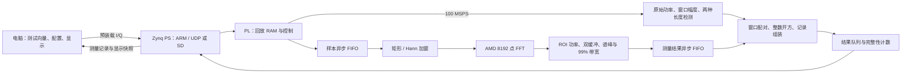

# 无线通信系统数字基带信号频谱分析电路设计

**参赛技术报告·可编辑稿**  
赛道：FPGA 设计及应用  
平台：Digilent Zybo Z7-20，Zynq-7020 / XC7Z020CLG400-1  
工程：`iq_analyzer`  
编制日期：2026-09-18；实测更新：2026-09-19  
参赛队伍、成员、指导教师：待提交前填写

本文说明当前工程的设计、测量定义和验证方法，供参赛报告及答辩使用。本轮全链路构建、实板及SD复位启动验证已完成，实际数据与验证边界见[当前验收状态](验收状态.md)及其关联证据。

## 1. 设计目标与方案选择

赛题要求设计数字基带 I/Q 频谱分析电路，测量信号幅度、帧长度、频点及带宽，并完成 RTL、前仿真和 FPGA 板级测试。题面明确要求 I/Q 位宽不低于 12 bit、数据速率不低于 100 MSPS、FFT 不少于 8192 点、分析处理时间不超过 2 ms；带宽项给出 MHz 单位及性能评价方向，没有规定最低数值。

本工程选择“电脑装载数字测试向量、FPGA 高速回放并分析”的方案。电脑生成或读取 I16/Q16 文件，经 ARM 处理器装入 PL 回放 RAM；开始后，PL 以 100 MHz 每拍处理一对样本。ARM 负责控制和结果传输，FFT 与测量在 PL 内完成。该方案让输入内容可精确重复，便于将 RTL、板上结果与独立参考逐项比较。

现有题面针对数字基带信号，没有明确要求 ADC 或禁止厂商 FFT IP。设计采用 AMD FFT IP，并明确区分外围自研电路与厂商组件。若主办方发布补充规则，应在提交前复核；本报告不将该解释表述为主办方认可结论。

| 赛题要求 | 当前设计配置或对应功能 | 最终证明方式 |
|---|---|---|
| I/Q 位宽 ≥12 bit | I、Q 各 16 bit，有符号二进制补码 | 输入格式、负满幅测试、RTL 与板测 |
| 数据速率 ≥100 MSPS | 板内回放标称 100 MSPS | 有效样本计数、相邻窗口时间戳、完整性记录 |
| FFT ≥8192 点 | 固定 8192 点复数 FFT | 实际 IP 配置及逐点位精确核验 |
| 分析时间 ≤2 ms | 窗口首样本至频域测量记录形成的硬件时间差 | 当前仿真及实板最大延迟，不能用 GUI 刷新时间代替 |
| 信号幅度 | 原始 I/Q 复包络峰值、RMS、能量 | 整数参考及幅度边界测试 |
| 帧长度 | 门限突发、数字零背景波形两种定义 | 模式对应的区间参考与误差分析 |
| 频点、带宽 | 谱峰、99% 占用带宽两端及中心 | 单音、QPSK、ROI 和功率分位测试 |
| RTL、前仿真、板级测试 | 分层验证与源码/产物散列关联 | 见第 7、8 节证据索引 |

这里的 100 MSPS 是 **FPGA 分析入口速率**，不是电脑经千兆网口持续传入新数据的速率。I16/Q16 每对 4 字节，100 MSPS 对应 400 MB/s，超过 1 Gbit/s 链路能力。回放 RAM 最大存放 32,768 对样本，对应 327.68 µs；连续运行重复这段已装载波形。

## 2. 系统架构与实现范围

PL 中，`iq_peripheral.sv` 负责 AXI-Lite 控制、回放和结果队列，`analyzer_core.sv` 连接时域与频域支路。时域支路保留未加窗样本的功率统计；频域支路经异步 FIFO 进入 125 MHz 域，完成加窗、FFT 和频谱测量，再回到 100 MHz 域组装结果。每条频域记录与同一窗口的时域统计通过窗口编号配对，失配或队列异常会产生错误信息。

### 2.1 自研与复用边界

| 内容 | 实现范围 |
|---|---|
| 回放与控制 | 本工程实现 AXI 寄存器、运行状态、配置提交、停止及结果队列 |
| 时域测量 | 本工程实现功率、峰值、能量、门限突发及数字零背景检测 |
| 频域外围 | 本工程实现窗函数适配、索引重排、功率双缓冲、谱峰、99% 带宽和快照 |
| 定点与结果 | 本工程实现整数除法、平方根、频率换算、窗口配对和记录格式 |
| FFT 运算核 | 实际使用 AMD LogiCORE FFT v9.1，不声明为自主 FFT |
| 跨时钟基础单元 | 使用 AMD XPM 异步 FIFO/同步器；跨域连接、约束与运行协议由本工程设计 |
| 板级与处理器基础软件 | 采用 Digilent 板级定义、AMD BSP/FSBL、lwIP、FatFs |
| 应用与验证 | 本工程实现 UDP 应用协议、SD 自动测试、电脑客户端、GUI、数值核验及构建验收脚本 |

开源 FFT 项目用于方案调研和结构参考，没有将其 RTL 移植为当前 FFT 核，也不引用其性能作为本板成绩。具体来源、提交及许可边界见[参考与复用说明](参考与复用说明.md)和[第三方声明](../THIRD_PARTY_NOTICES.md)。

## 3. 数据格式与定点运算

### 3.1 输入与时域幅度

文件采用小端交错 I16/Q16：每个 32 位字的低 16 位为 I，高 16 位为 Q。原始功率定义为：

\[
p[n]=I[n]^2+Q[n]^2,\qquad E=\sum_{n\in\mathcal W}p[n]
\]

对长度为 \(L\) 的测量区间，复包络峰值和 RMS 为：

\[
A_{\mathrm{peak}}=\sqrt{\max p[n]},\qquad
A_{\mathrm{rms}}=\sqrt{E/L}
\]

结果用 UQ16.16 表示，即记录整数除以 65,536 得到数字码值。硬件使用整数除法和向下取整的整数平方根，核验也采用相同精度定义。幅度不换算为电压或 dBm；窗口幅度来自原始 I/Q，改变 FFT 窗函数不会直接改变它。

| 信号或统计量 | 位宽与设计依据 |
|---|---|
| 原始 I、Q | 各 16 位有符号；含 −32768 边界 |
| 原始复功率 | 32 位无符号；两路均为 −32768 时为 \(2^{31}\) |
| 时间区间能量 | 64 位累加；与配置允许的最大区间长度配合使用 |
| FFT 输入/输出实部、虚部 | 各 24 位有符号定点 |
| FFT 复功率 | 48 位；两路负满幅平方和可达 \(2^{47}\) |
| 8192 点谱总功率 | 64 位；满幅理论累加量级为 \(2^{60}\) |

零值、1 LSB、小幅波形和两路负满幅均属于验证对象，避免仅用中等幅度正弦波证明定点范围正确。

### 3.2 窗函数与 FFT 缩放

支持矩形窗和周期 Hann 窗：

\[
w[n]=\frac12-\frac12\cos\left(\frac{2\pi n}{8192}\right),\qquad 0\le n<8192
\]

Hann ROM 使用 18 位无符号数、17 位小数，系数 131072 表示 1。原始 int16 与系数相乘后除以 512，按最近偶数舍入得到 24 位输入；矩形窗等效于原始样本左移 8 位。将 24 位输入解释为 Q1.23 时，与 int16 除以 \(2^{15}\) 的归一化含义一致。

FFT 为单通道流水流式结构，使用 24 位数据、18 位旋转因子、收敛舍入、位逆序输出和真实频点索引。复位后发送配置 `0x3557`；对应缩放表为 `[3,2,2,2,2,2,1]`，总缩放 14 位。完整位精确核验使用同配置的 AMD C 模型。

Hann 窗抑制旁瓣，也会改变主瓣宽度及谱功率分布。因此报告同时保存窗类型，不能混合比较两种窗下的带宽。FFT 谱功率用于相对分布及带宽计算；独立时域支路提供原始幅度，避免将 FFT 缩放后的谱峰直接冒充输入幅度。

## 4. 频点与 99% 占用带宽

FFT 的输出下标为 \(k\)。硬件通过 `q = k XOR 4096` 将其映射到从负频率到正频率的地址顺序，而不要求 FFT 按自然顺序输出。频率映射为：

\[
f(q)=\frac{(q-4096)F_s}{8192},\qquad F_s=100\,000\,000\ \mathrm{Hz}
\]

每窗口持续 81.92 µs，频点间隔 12,207.03125 Hz。频点范围为 −50 MHz 至 \(50\,\mathrm{MHz}-F_s/8192\)。记录中的 Hz 数值按整数舍入，不以显示小数位数增加真实频率分辨率。

ROI 含上下端点，ROI 外功率置零。设重新排序并屏蔽后的谱功率为 \(P[q]\)，总功率为 \(T\)，累计功率为 \(C[q]\)：

\[
T=\sum_qP[q],\qquad C[q]=\sum_{j=0}^{q}P[j]
\]

\[
q_L=\min\{q:C[q]\ge\lceil T/200\rceil\},\qquad
q_H=\min\{q:C[q]\ge T-\lfloor T/200\rfloor\}
\]

\[
BW_{99}=\frac{(q_H-q_L)F_s}{8192},\qquad
f_c=\frac{f(q_L)+f(q_H)}{2}
\]

上下两侧各去除约 0.5% 的功率；离散频点上的取整及跨阈值 bin 会使保留比例不必恰好等于 99%。带宽取两个端点**中心频率之差**，不额外加一个 bin。谱峰选最大功率点，功率相同则取较低频率的 bin。

功率 RAM 采用两帧交替缓冲，每帧按偶数/奇数 bin 分成两组存储，每拍扫描两个频点。这样可在写下一帧时处理前一帧。显示快照每 8 个 bin 取最大值，形成 1024 点数据；正式带宽仍由完整 8192 点计算，显示降采样不参与带宽估计。

边界处理包括：全零谱输出无信号标志；单 bin 占用可得到 0 Hz 并标记分辨率受限；端点接触 ROI 边界时标记边缘风险；FFT 溢出及数据完整性异常单独记录。不能通过缩小 ROI 隐去不利谱分量后仍称为全信号带宽。

单音谱峰可直接用于频率验证。QPSK 的最高谱线会随符号序列和窗口改变，谱峰不必等于设定的 8 MHz 频移；因此同时给出占用带宽中心。QPSK2 的理想成形支持带宽、8192 点窗口下的 99% 测量带宽和模拟射频带宽是不同概念，本工程只报告对应数字波形的实际测量定义。

## 5. 两种长度检测及适用边界

两种模式均以有效样本序号表示半开区间 `[start, end)`，长度为 `end-start`，时间为长度除以采样率。`valid=0` 不代表输入了一个零样本，也不推进检测样本序号。检测状态跨越 FFT 窗口及 RAM 循环边界连续保留。

### 5.1 门限突发模式 `threshold`

对原始功率进行 16 点滑动求和，采用启动/结束双门限及连续确认。默认 `Ton=1048576`、`Toff=262144`、`Kon=8`、`Koff=32`。该模式测量通过给定能量检测规则的突发区间，适合不应把所有微小非零量化值都视为信号的情形，但参数仍需对应信号和背景条件。

`burst_fs4` 的真实量化非零区间为 `[2048,26624)`，长度 24576 点；默认门限参考得到 24591 点，多出的 15 点对应 150 ns，源于该波形和参数下的滑动和尾部。这个差值不能作为所有波形通用的“固定减 15 点”校正，幅度、包络、门限与噪声改变时必须重新分析误差。

### 5.2 数字零背景模式 `digital-zero`

当 `I!=0` 或 `Q!=0` 时判为非零；连续 `gap_min` 个全零有效样本确认波形间隔，默认 32。完整区间从首个非零开始，结束位置回指最后非零样本的下一点。短于 `gap_min` 的内部零段保留在同一区间内并计入长度及 RMS 分母；尾部用于确认的全零样本不计入已确认区间。

在前后空闲均被完整观察且没有强制分段时，`burst_fs4` 的参考长度为 24576 点，即 245.76 µs。这是按数字输入定义得到的预期结果，是否通过本次实板核验应查对应测量记录。

| 标志 | 解释及对长度结论的影响 |
|---|---|
| `DIGITAL_ZERO` | 表明记录使用数字零背景定义，不能套用门限模式黄金值 |
| `START_UNCONFIRMED` | 开始前观察到的连续零不足，或为强制分段后的续段；不能声称真实起点已确认 |
| `CAPTURE_TRUNCATED` | 采集停止前未确认结束；终点取观测末尾，尚未确认的尾零可能计入区间 |
| `DETECTOR_TIMEOUT` | 达到最大长度，输出观测分段；不能把各段都称为独立完整帧 |

当结束确认与最大长度边界同拍发生时，数字零检测优先采用已确认的结束。强制分段后，在间隔尚未确认时甚至可能出现零能量续段，记录通过标志保留其观测含义，不将其解释为新通信帧。

两种模式均不识别协议前导、帧头或载荷，不能称为通信协议帧同步。数字零模式不恢复量化前消失的小幅尾部，噪声或直流偏置使背景持续非零时也不具备通用精确边界能力。报告应分别说明“检测算法是否精确实现”和“检测定义相对待测波形边界的偏差”。

## 6. 时钟、吞吐与延迟优化

PS FCLK0 提供 100 MHz，用于回放、AXI、时域统计和结果组装；FCLK1 提供 125 MHz，用于 FFT 和功率谱处理。100 MHz 与 125 MHz 跨域通过异步 FIFO；配置只允许停止时修改，启动前稳定并同步。复位与错误状态也按各自域进行同步，不以无约束路径规避时序验证。

频域记录包含窗口首样本的 `start_tick`、形成测量记录时的 `done_tick` 及二者之差。**分析延迟**包含收集 8192 点窗口、加窗/FFT、功率谱扫描、跨域、配对和幅度计算；不包含此前电脑上传波形、之后网络传输或 GUI 显示时间。**发布延迟**进一步计入记录写入硬件结果队列的时间，两者分开统计。

时间换算使用记录中的采样率和对应时基。当前计时基于标称 100 MHz，未声称已使用校准仪器完成绝对时间计量。连续输入吞吐合格与单窗口延迟合格是两个独立条件，应分别核验。

本轮局部优化在 ROI 屏蔽功率后增加寄存级，并将 bin、valid、last、overflow 同步延后一拍，从结构上切断 ROI 比较至峰值选择的长组合路径。单独 A/B 仿真验证过相同数值与快照，最后 FFT 输入到测量输出相差一拍，即 125 MHz 下的 8 ns；该改动目标是改善时序收敛，不能表述为减少整体分析延迟。整体效果必须以本轮完整实现、资源和实板结果评价。

双缓冲及双点扫描可使采集和统计重叠；结果用硬件整数运算生成，减少 ARM 逐点处理。事件过密仍可能超过结果组装或队列服务能力，工程检测丢弃与溢出，不承诺任意事件率下无限无损处理。

## 7. 验证方法

验证分为数学参考、RTL 前仿真、静态实现和实板四层。每层回答不同问题，不能用仿真文件代替板卡原始输出。

1. **FFT 与固定点参考。** `tests/make_golden.py` 使用本机 AMD 位精确 C 模型，参数与实际 IP 一致；对 8 类波形及矩形/Hann 两种窗的 16 组合、64 个窗口核对共 524288 个复数输出。NumPy 可用于生成波形和画图，不替代 FFT 位精确判断。
2. **测量独立参考。** 由整数功率、累计分位和区间定义计算预期结果。门限与数字零模式分别维护参考，避免修改算法后仍套用旧帧长。
3. **RTL 边界回归。** 覆盖负满幅、零输入、舍入和整数算术、AXI 非法配置及运行时写入、有效气泡、首末样本、gap 边界、跨窗口、停止和最大长度分段。频谱专用测试覆盖 ROI 内外、同峰取低 bin、最后 bin、双 bank 复用、overflow 和快照重装。
4. **实现检查。** 对综合后布局布线的 setup/hold、未约束内部端点、CDC、总线偏斜及 DRC 检查。只在门禁通过后推广 bit/XSA，不用目标频率或综合估计代替布线后结果。
5. **板级数值验证。** 对标准向量保存完整频域/突发原始记录及元数据，逐条核对编号、时间戳、幅度、频点、带宽、长度、标志和可用快照。本轮 full 套件的32组有限采集、两种模式各自10秒与60秒连续采集均通过；通过范围以当前散列绑定报告为准。
6. **完整性与故障验证。** 统计硬件完成数、队列丢弃、UDP 包序号和实际记录数；正常数值测试与断网/过载等故障注入分开。发现丢失应保存并报告，不补造记录。

电脑 GUI 的包络图来自输入文件参考，硬件频谱快照和测量数值来自 PL 结果；答辩时应明确两者来源。GUI 刷新是展示行为，完整验收以原始二进制及核验结果为依据。

## 8. 当前性能与证据填写方式

本轮硬件构建和双模式完整网络数值验收已于2026-09-19通过。下表列出本轮数据；其他验证范围和实体SD启动状态以[当前验收状态](验收状态.md)及其证据为准。

| 项目 | 当前设计值 / 提交时需填内容 | 依据 |
|---|---|---|
| I/Q 位宽、采样率、FFT 点数 | 16+16 bit、100 MSPS、8192 点 | 配置、RTL、实际记录中的采样率与点数 |
| 最大分析 / 发布延迟 | 199.79 / 200.13 µs，完整网络数值套件 | 当前实板报告及每例原始记录 |
| QPSK 99% 带宽 | sps=2、Hann窗4个窗口，54.663086～54.895020 MHz | 当前频域记录及位精确参考 |
| 数字零背景长度误差 | 所选8组完整波形起止和长度均0点误差；截断/超时另外标志 | 帧长度定义与误差分析 |
| Setup / hold、资源占用 | 0.030 / 0.004 ns；LUT12359、FF20030、BRAM90.5、DSP53 | 当前 timing、utilization 与硬件验收报告 |
| CDC / 未约束端点 / DRC | Critical=0 / 内部端点=0 / 通过 | 实现报告 |
| 连续运行与丢弃数 | 两种模式各10秒和60秒；正常完整套件零异常/丢弃/缺包 | `capture.json`、原始记录及板测汇总 |
| SD 启动 | 区分文件写入核验、SD 重启和 JTAG 装载 | SD 独立记录与实际启动版本 |

证据入口和用途如下。部分本轮文件只在相应步骤成功后生成；缺少文件或散列不匹配时，该项应标记“待验收”，不能从基线推断通过。

| 入口 / 文件 | 使用方式 |
|---|---|
| [当前验收状态](验收状态.md) | 查阅本轮进展、已通过范围及报告链接 |
| `reports/构建验证报告.md` | 当前静态构建摘要，不代表板测 |
| `reports/simulation_provenance.json`、`hardware_provenance.json` | 将当前输入、IP、产物和验证证据关联到散列 |
| `reports/core_validation.json`、`hardware_validation.json` | 数值回归与静态实现的结构化结果 |
| `reports/software_validation.json`、`boot_provenance.json` | 证明 ELF 对应 XSA、BOOT 对应 FSBL/bit/应用 |
| `reports/current_deployment.json` | 关联实际 JTAG 下载日志和二进制身份 |
| `reports/current_board_validation.json` | 查完整本轮板测、每例目录及通过范围 |
| `captures/<本轮目录>/...` | 查 `capture.json`、`frequency.bin`、`burst.bin`、快照和 `measurement_validation.json` |
| `reports/sd_boot_update.json` | 如执行板上 SD 更新，查全量读回散列及独立启动状态 |
| [基线验收报告](../reports/baseline_20260917/最终验收与交付说明.md) | 仅用于基线对照，不替代当前源码验收 |

引用性能时应注明其为理论配置、RTL 仿真、静态时序还是实板测量。例如“16+16 bit”来自接口定义，“最大分析延迟”应来自指定配置下的测量记录，“setup 裕量”来自布线后时序；不能把它们混写成同一种实测证据。

## 9. 现场演示顺序

下面是演示安排，实际操作参数和完整命令见[使用与设计说明](使用与设计说明.md)，避免在报告维护第二套操作手册。

| 顺序 | 操作与展示内容 | 评审可核验的要点 |
|---|---|---|
| 1 | 展示 Zybo 实物、USB/网线、当前版本和验收索引 | 型号、输入方式、当前实际运行版本与交付一致 |
| 2 | 单次采集 +25 MHz、−25 MHz 相干单音 | I/Q 正负频率、峰频率、8192 点、原始幅度；切换窗观察带宽差异 |
| 3 | 对 `burst_fs4` 分别运行 threshold 和 digital-zero | 展示两种长度定义、24591/24576 点参考及对应本次实际结果，不隐去差异 |
| 4 | QPSK4 与 QPSK2 的 Hann 窗采集 | 显示带宽增大、谱峰与带宽中心的区别，解释非零区间和成形尾部 |
| 5 | 运行已验证时长的连续采集并正常停止 | 展示完整记录数、零异常/丢弃的实际状态、硬件最大延迟；有异常则如实说明 |
| 6 | 打开刚保存的原始结果和核验报告 | 证明图形、整数记录、输入散列和参考可以相互追溯 |
| 7 | 若已单独验证 SD 启动，再演示重启 | 展示从 SD 启动后的版本及网络恢复，不把一次 JTAG 运行作为 SD 成功依据 |

一次只运行一个采集端。演示所用目录应新建，保留本次记录；不要仅播放旧截图冒充当前运行。核心演示稳定后才增加故障注入，正常性能与故障恢复结论分别展示。

## 10. 贡献、限制及提交前待补材料

本工程的主要设计贡献是：可重复的高速数字回放与测量链路、保留原始幅度的时频并行处理、支持位逆序 FFT 输出的功率双缓冲、完整 8192 点上的整数 99% 带宽、区分检测含义的双长度模式，以及从源码到原始实板记录的验证关联。本轮流水调整属于可度量的工程优化；是否获得性能收益应由当前实现报告说明，不将结构改动本身等同于更高得分。

当前实现固定为 100 MSPS 输入和 8192 点 FFT，使用 AMD FFT IP，不包含外部 ADC、射频接收、协议帧头识别或 125 MSPS 输入实现。循环回放的测试范围、零背景检测适用条件和未校准时基应随结果一并说明。

提交前尚需补齐以下材料；它们不阻止当前工程开发和验证：

- 队伍/成员/教师信息及各成员承担工作。
- 主办方正式提交模板、文件命名及附件/视频要求；确认补充规则对厂商 IP 和数字回放的要求。
- 用户提供或现场拍摄的真实开发板、接线和运行照片，标明实拍日期及对应版本；不以生成图片替代硬件证据。
- 当前通过版本的 GUI 截图、演示录屏、性能表与实测报告链接。
- 最终源码提交标识、交付清单及 SHA-256，核对交付包与演示板运行镜像一致。

答辩前应删除本稿仍未填写的占位项，或明确标注未完成范围；既有事实、实测数据和后续设想保持分开。
