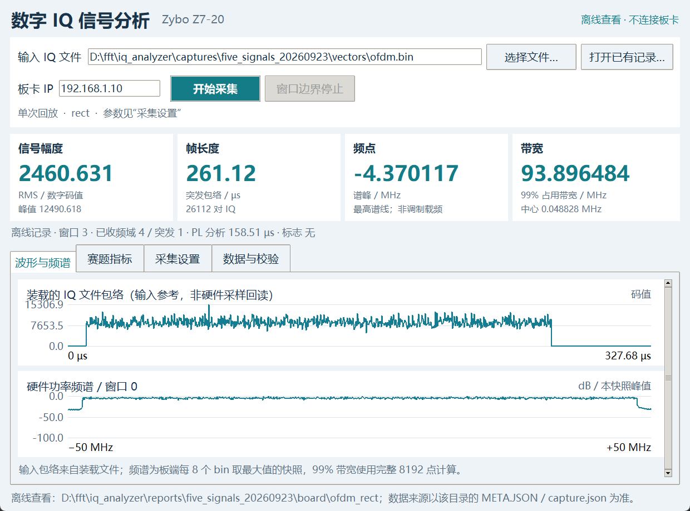
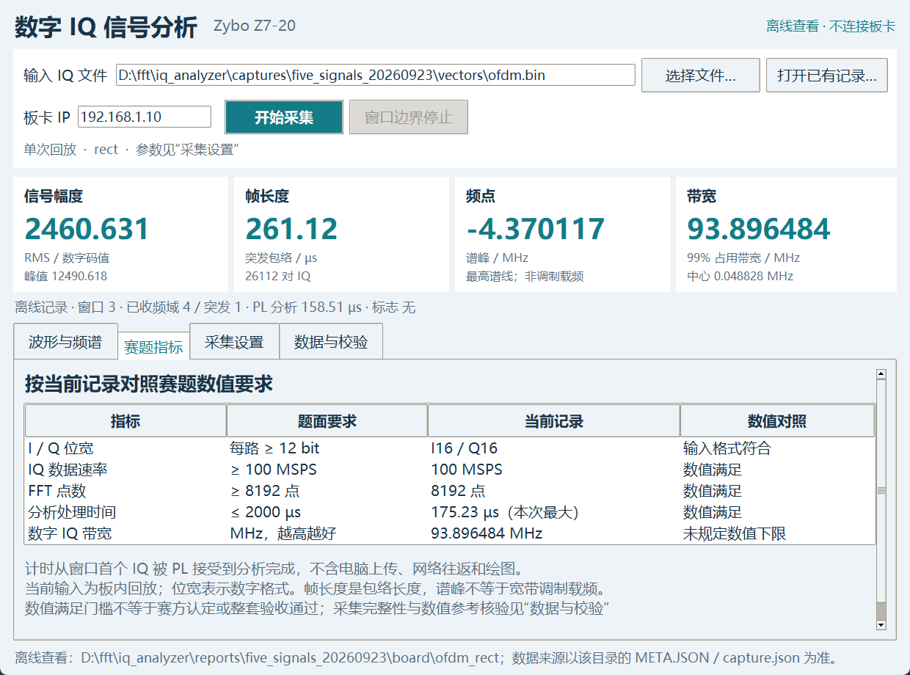

# 新版上位机使用说明

本版按赛题的“信号幅度、帧长度、频点、带宽”排列测量结果。原有参数、数据显示、采集和记录读取功能全部保留。

## 打开和开始测量

1. 如果旧界面正在采集，先点击“窗口边界停止”，等记录保存完成，再关闭旧界面。
2. 双击工程根目录的 `Open_IQ_Monitor.cmd`，即打开新版。无需重新烧写板卡。
3. 点击“选择文件…”选择 IQ 文件；默认板卡 IP 为 `192.168.1.10`。
4. 到“采集设置”确认分析窗、循环回放、持续秒数和测长模式，再点击“开始采集”。
5. 需要提前结束时点击“窗口边界停止”，等待保存完成。结果保存在工程的 `captures` 目录，每次使用独立目录。

例如使用 `data/vectors/burst_fs4.bin`，在“采集设置”选 `hann`、`digital-zero`，取消循环回放，保持零间隔确认 32 点。采集后应测得 24576 对 IQ、245.76 µs 的数字零背景波形长度。文件中的数字零前后区间用于确认波形边界。

## 首页四张结果卡片

| 卡片 | 大数字的含义 | 同时保留的信息 |
| --- | --- | --- |
| 信号幅度 | 当前 FFT 窗口的 RMS 数字码值 | 同窗口峰值；不是直接测量的伏特数 |
| 帧长度 | 最近一条突发包络的长度，单位 µs | 对应 IQ 点数；完整性标志在卡片下方及详细数据中 |
| 频点 | 当前 FFT 窗口最高谱线位置，单位 MHz | 正负号表示相对数字基带中心的频率方向 |
| 带宽 | 当前 FFT 窗口的 99% 占用带宽，单位 MHz | 带宽中心频率 |

“帧长度”当前实现为包络测长，并不识别通信协议帧。宽带调制信号的最高谱线也不等于其载频。卡片下方显示记录来源、窗口编号、已收记录数、PL 分析延迟和标志；它们来自实际记录。



图中是历史 OFDM 记录的最后一个窗口，不能把它当作本轮新采集或每一种输入的固定结果。

## 四个标签页

| 标签页 | 内容 |
| --- | --- |
| 波形与频谱 | 输入 IQ 文件包络，以及板端功率频谱快照 |
| 赛题指标 | I/Q 位宽、IQ 数据速率、FFT 点数、分析时间、带宽的要求与当前记录数值 |
| 采集设置 | 常用设置和全部高级门限参数 |
| 数据与校验 | 原有完整测量文字、全部当前更新字段和元数据，支持复制 |

窗口较小时，使用右侧滚动条查看页面下方内容。“数据与校验”的文字和原始字段也可滚动查看。

“赛题指标”按每路至少 12 bit、至少 100 MSPS、至少 8192 点、分析时间至多 2000 µs 对照；题面带宽只写 MHz，未设数值下限。存在硬件最大延迟元数据时，显示本次最大值；否则显示当前窗口值。数值对照不代表赛方评分或整套系统验收。



## 原有内容现在在哪里

| 原界面的设置或数据 | 新位置 |
| --- | --- |
| 板卡 IP、输入文件、开始、窗口边界停止、打开已有记录 | 顶部工具区 |
| 持续秒数、循环回放、rect/hann | 采集设置 → 常用采集参数 |
| threshold/digital-zero、零间隔确认点数 | 采集设置 → 常用采集参数 |
| legacy/robust、fixed/quiet-prefix、前导静默点数 | 采集设置 → 高级门限参数 |
| ton、toff、kon、koff 手动覆盖值 | 采集设置 → 高级门限参数；留空沿用档位 |
| RMS、峰值、峰频率、99% 带宽、带宽中心、PL 延迟 | 顶部结果及数据与校验 |
| I16/Q16、实际速率、FFT 点数、分析窗 | 赛题指标及数据与校验 |
| 窗口编号、频域/突发记录数、标志 | 卡片下方及数据与校验 |
| 包络长度、点数、起止确认/截断/超时状态 | 数据与校验 |
| 采集完整性、UDP 缺包、硬件错误、最大发布延迟、数值参考核验 | 数据与校验 |
| 实际应用的门限和确认点数 | 数据与校验 |
| 输入包络和板端频谱 | 波形与频谱 |

本版还展示包络起止点、包络 RMS/峰值、构建 ID、时钟及吞吐计数，并提供完整原始字段视图。显示的是最新频域记录、最近突发记录及最近频谱快照，各自的编号可能不同；所有逐条原始记录继续保存在采集目录。

采集过程中，配置控件暂时锁定；开始新采集时清空上一轮卡片，避免误读旧值。切换为 `digital-zero` 时自动清除门限覆盖并恢复兼容档位。历史记录的原 IQ 文件不可用时，仍展示测量结果，并明确提示缺少输入包络。

## 已完成的验证

2026-09-28 已对当前同一版界面再次完成18项回归，包含4项真实板卡采集和独立数值核验，全部通过、UDP缺包为0。源码与9月25日GUI记录绑定一致；本次原始证据及组合交付范围见[收尾验收说明](../reports/closeout_20260928/收尾验收说明.md)。

独立回归于 **2026-09-25 14:07:14 +08:00** 完成，共 **18 项通过**。

- 单音、双音、扫频、QPSK、OFDM，各自 rect/hann 两种分析窗：共 10 组历史实板记录显示核对。
- 四项真板采集：门限循环定时、数字零单次、实际停止按钮、5 dB robust 单次。均完成采集完整性及独立数值核验，UDP 缺包均为 0。
- 1240×920 与 900×720 的全部页面可达性、历史输入缺失处理、测长模式切换，以及原演示程序兼容性检查。
- 测试结束确认采集线程停止、板卡回到空闲状态。

数字零单次测试实测起止点为 `[2048, 26624)`，长度为 24576 对 IQ。详细结果见 [回归 JSON](../reports/gui_redesign_20260925/gui_validation.json)。完整采集二进制和测试截图保存在本机 `captures/gui_redesign_20260925_v1`。

复现检查时，板卡须空闲，并为输出指定一个全新目录：

```powershell
python scripts/check_monitor_redesign.py --out captures/gui_redesign_new_run
```

本次只变更上位机显示与交互，采集协议文件 `host/iq_client.py` 的 SHA-256 与冻结验收一致。原完整系统验收、冷启动证据和发布包不改写；上位机源码发生变化，因此旧整包源码散列不能直接作为新版完整交付资格。本报告仅证明本次界面及采集回归范围。
