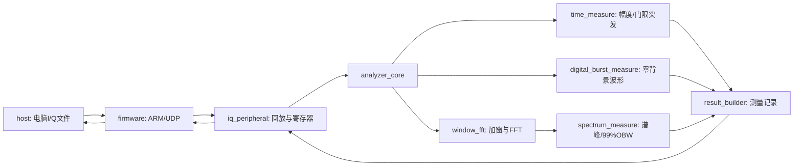

# 架构与开发指南

## 系统边界

本工程针对数字基带I/Q信号。电脑负责生成与装载测试文件；PL负责100MSPS连续处理，PS负责配置和传输结果。

新增零背景支路的实际启用与版本状态见[当前验收状态](验收状态.md)。

## 核心代码

| 文件 | 职责 |
|---|---|
| `rtl/iq_peripheral.sv` | AXI寄存器、回放RAM、启动/停止、结果队列、快照 |
| `rtl/analyzer_core.sv` | 数据支路、异步FIFO、复位及错误同步 |
| `rtl/time_measure.sv` | 窗口功率与默认门限检测 |
| `rtl/digital_burst_measure.sv` | 可选零背景分组及长度（新版本） |
| `rtl/window_fft.sv` | 矩形/Hann窗及AMD FFT流接口 |
| `rtl/spectrum_measure.sv` | 功率双缓冲、谱峰、累计功率带宽 |
| `rtl/result_builder.sv` | 整数平方根/除法、Hz换算、记录发布 |
| `rtl/math_units.sv`、`small_fifo.sv`、`record_ring.sv` | 算术及队列基础模块 |
| `firmware/echo.c`、`firmware/sd_main.c` | 网络交互和SD自动测试 |
| `host/iq_client.py`、`host/monitor.py`、`host/analyze_sd.py` | 采集/显示/SD解码 |

## 数据和时钟

- 输入I、Q各16位，低16位为I，高16位为Q；小端整数文件。
- 源、AXI及结果组装100MHz；FFT与功率谱125MHz。
- FFT固定8192点；窗口时长81.92µs，频点间隔12.20703125kHz。
- 数据跨域使用FIFO，静态配置只允许停止时修改。
- 频域记录128字节，突发记录64字节；编号、epoch、配置与错误标志用于核验完整性。
- GUI显示频谱每8点取最大值，正式99%带宽仍由完整8192点功率谱计算。

## 构建关卡

`scripts/run.ps1` 提供：

| Action | 内容 |
|---|---|
| Reference | 输入向量、独立数值参考、算术与测量测试数据 |
| Sim | 模块/系统/AXI仿真及主机回归 |
| Hardware | 从Tcl重新建立板级工程并完成实现 |
| RebuildHardware | 现有板级工程中更新RTL/约束，再实现 |
| Software | 依据导出XSA构建FSBL及SD/UDP应用 |
| Package | 核对证据与产物，生成两套SD启动包 |
| All | 按上述阶段完整执行 |

新增RTL文件必须进入仿真及板级工程fileset。
更改FFT参数须显式重新运行`scripts/create_fft.tcl`；更改PS时钟须运行Hardware。
RebuildHardware不会替你重新定义PS时钟或FFT IP配置。

所有构建日志进入`build/logs/`，Vivado工程进入`build/`，导出进入`artifacts/`。
不要将测试台或历史日志混入`rtl/`，也不要将未经验证的产物覆盖已验证基线包。

## 验证原则

1. 原默认模式的16组合和524288个FFT输出保持位精确。
2. 新模式单独验证区间、幅度、标志和停止边界；不套用旧门限黄金值。
3. 时序/CDC/DRC通过后才能发布bitstream。
4. ARM应用必须匹配当前XSA，主机识别功能版本。
5. 采集完整性和测量数值正确性分别验证。
6. 正常测试与故障注入分开统计，丢失数据不会自动补齐。
7. 实板报告与实际文件散列对应，构建成功不代表板测成功。

当前完整交付流程是：`run.ps1 -Action All` → `maintenance/validate_sd.py`（SD应用实测）→ `deploy_board.py` → `validate_board.py --suite full` → `analyze_frame_lengths.py` → `board_extended_validation.py` → `check_monitor_board.py` → SD更新/复位检查 → `write_acceptance_report.py` → `package_validated.py`。各板测命令的输出目录必须新建；具体参数见演示卡和维护说明。

解压已验证交付后，可运行`python scripts/verify_delivery.py .`检查文件散列；这项检查不需要Vivado或连接板卡，也不代替重新板测。

## 工程整理约定

根目录仅保留维护入口、版本/许可、依赖及运行快捷命令。
`docs/`存放维护文档，`reports/`存放当前验证及有索引的基线记录。
已结束的临时探测脚本与根日志从工作入口移除，必要历史可由Git基线及归档恢复。
保留第三方许可证、测试真值、原始实板记录及已验证发布包。
