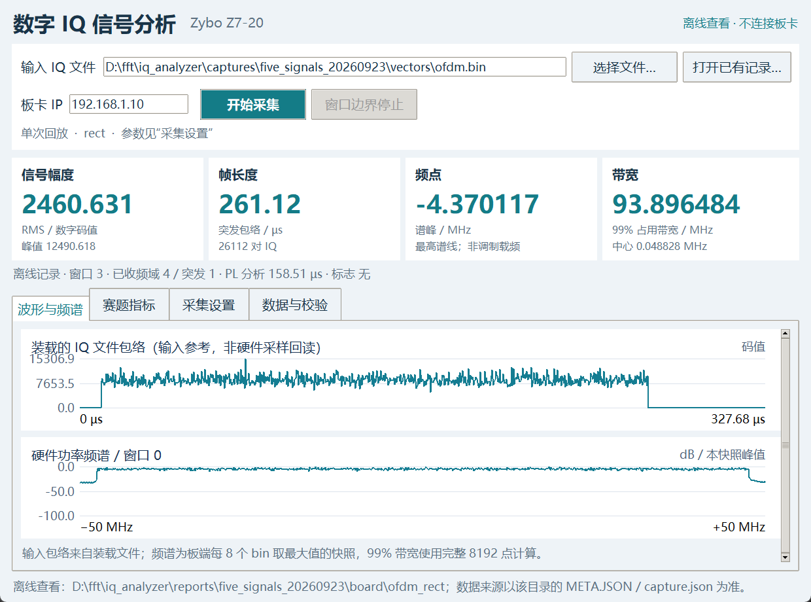

# 2026-09-28 项目收尾验收说明

本次完成新版上位机的实际板卡复测、项目总结、版本整理和独立本地交付。硬件构建ID为 `3bc7d0840b0602203141e9ee228e80e3`，接口 `0x00010002`，100 MSPS输入、125 MHz FFT、8192点FFT、八路扫描。

## 本次真实验证

板卡连接到 `192.168.1.10`。测试前核对身份、空闲状态和镜像散列；测试结束确认采集线程停止、板卡空闲。

| 验证 | 结果 |
|---|---|
| 新版界面回归 | 18项全部PASS |
| 五类信号 × 两种窗函数的历史记录显示 | 10组通过 |
| 实板：门限循环定时 | 36484条频域、9121条突发记录，独立数值核验PASS |
| 实板：数字零单次 | 4条频域、1条突发记录，独立数值核验PASS |
| 实板：窗口边界停止按钮 | 1161条频域、291条突发记录，独立数值核验PASS |
| 实板：5 dB robust单次 | 4条频域、4条突发记录，独立数值核验PASS |
| 本次最大分析/发布延迟 | 175.22/175.56 µs |
| 四项实板采集 | UDP缺包0、硬件错误0、吞吐计数守恒 |
| 主机自动检查 | Python语法、8项协议测试、9项长度参考测试、11项检测兼容测试通过 |
| 五类信号归档 | 140个文件散列、23个报告链接通过 |

机器可读记录：[GUI回归](gui_validation.json)、[主机检查](host_checks.json)、[交付资格核验](validation.json)。原始采集在 `captures/gui_closeout_20260928/`；本目录保存相同GUI报告及截图，原始记录随完整包交付。



该概览截图显示历史OFDM记录，不冒充本次新输入；`threshold_timed.png`、`digital_zero_finite.png`、`window_boundary_stop.png`、`robust_5db_finite.png`对应本次四项实际采集。

## 验证范围与旧记录的关系

原9月22日硬件版本已有完整矩阵、静态时序、SD镜像和物理冷启动验收。本次没有修改RTL、固件、时钟或通信协议，也没有重新烧写SD。

旧完整仿真门禁把整个 `host/` 的Python源码都作为输入绑定。当前与旧仿真输入相比，仅 `host/monitor.py` 改变、`host/monitor_view.py` 新增。因此直接调用旧 `package_release.py --check` 会拒绝“全部当前源码与旧仿真一致”的声明，这个拒绝是预期行为。本次未修改旧仿真报告，也未放宽旧门禁。

新工具 `scripts/package_closeout.py` 用独立范围核验：验证冻结ZIP、硬件构建与BOOT绑定、原实现和证据未变，仅允许上述两个界面输入差异；再验证本次界面源码、原始采集、数值结果和主机测试记录。任何超出界面范围的实现变化均拒绝交付。

因此本次完成的是“冻结硬件 + 新版上位机”的组合交付。新包不声称9月28日重新执行了2020组硬件矩阵或物理断电验收，正式性能仍采用175.23 µs分析延迟和指定OFDM内部窗最小96.997070 MHz占用带宽。

## 源码与交付

- 项目总结：[项目工程总结](../../项目工程总结.md)。
- 使用方法：[新版上位机使用说明](../../docs/新版上位机使用说明.md)。
- 完整本地包：`release/phase4-closeout-20260928.zip`。
- 完整包回执：`release/phase4-closeout-20260928_check.json`，以其中PASS、源码提交、ZIP散列及逐文件校验结果为准。
- 新包的源码提交写入 `manifest.json`，避免报告自引用提交造成散列循环。
- 已测试源码按原字节入包；少量文档、启动脚本和许可证存在Git的LF/CRLF转换，清单在 `checkout_line_endings` 中同时记录提交字节及交付字节散列，并检查差异只来自换行。
- 被更新的冻结文件保留在新包 `historical/frozen_phase4/`，旧完整包保持原字节。
- 本次仅完成本地版本管理，没有合并远端主分支或发布新的GitHub Release。

交付步骤（需要已验证的本机工作区，使用新输出目录）：

```powershell
python scripts/package_closeout.py --check
# 审阅并提交当前源码、说明和证据之后：
python scripts/package_closeout.py --out release/phase4-closeout-20260928
python scripts/verify_delivery.py release/phase4-closeout-20260928
```

解压包的内容核验不需要板卡或Vivado：在包根目录执行 `python scripts/verify_delivery.py .`。这只证明内容完整性，不代替重新构建或板测。原软件构建及SD维护仍引用组合构建目录，现阶段应保留 `D:\fft\iq_phase4_combined`。
