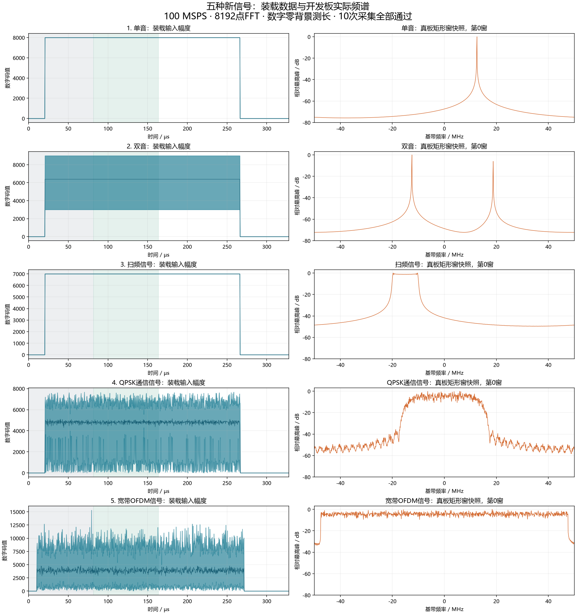

# 五组新信号真板测试结果

这次新生成单音、双音、扫频、QPSK、OFDM五组输入，每组使用矩形窗和Hann窗各测一次，共10次真板采集。

全部10次通过独立数值参考核验，共40条频域记录、10条包络记录、10240个快照数值；最大分析延迟175.23 µs。

板上构建：`3bc7d0840b0602203141e9ee228e80e3`。输入为100 MSPS板内回放，I/Q各16bit，8192点FFT。

信号名称来自本次生成时已知的设计，不代表电路能自动识别调制类型。本次没有添加噪声。

## 先看结果

下表幅度、峰频、带宽统一取第1号完整内部窗，即81.92～163.84 µs；长度来自整段数字零背景包络记录。幅度单位为数字码值，频率为基带频率。

| 信号 | 窗 | RMS幅度 | 峰值幅度 | 谱峰/MHz | 99%带宽/MHz | 包络长度/µs | 最大分析延迟/µs |
|---|---|---:|---:|---:|---:|---:|---:|
| 单音 | 矩形 | 8000.103 | 8000.206 | 12.500000 | 0.000000 | 245.76 | 175.23 |
| 单音 | Hann | 8000.103 | 8000.206 | 12.500000 | 0.024414 | 245.76 | 175.22 |
| 双音 | 矩形 | 6708.189 | 9000.000 | -12.500000 | 31.250000 | 245.76 | 175.21 |
| 双音 | Hann | 6708.189 | 9000.000 | -12.500000 | 31.274414 | 245.76 | 175.22 |
| 扫频信号 | 矩形 | 6999.994 | 7000.674 | -9.655762 | 13.183594 | 245.76 | 175.22 |
| 扫频信号 | Hann | 6999.994 | 7000.674 | -3.320313 | 9.033203 | 245.76 | 175.21 |
| QPSK通信信号 | 矩形 | 5004.056 | 7634.145 | -4.992676 | 29.077148 | 246.13 | 175.23 |
| QPSK通信信号 | Hann | 5004.056 | 7634.145 | -8.020020 | 29.150391 | 246.13 | 175.21 |
| 宽带OFDM信号 | 矩形 | 4381.907 | 12066.377 | -46.154785 | 94.213867 | 261.12 | 175.23 |
| 宽带OFDM信号 | Hann | 4381.907 | 12066.377 | 3.088379 | 94.165039 | 261.12 | 175.22 |

## 看图理解

左列为实际装载输入的幅度范围，每32点显示最小值到最大值；不是硬件回采的原始IQ。灰色区域对应右图的第0号快照窗，绿色区域对应上表第1号测量窗。

右列为开发板真实读回的1024点功率快照，每8个FFT格子取最大值。每行以各自最高峰归一化为0 dB，不能跨行比较绝对幅度。快照窗口含信号开头静默，所以与上表完整内部窗的带宽可能不同。

## 1. 单音

像一个固定音调。设定频率为+12.5 MHz，两种窗均准确落在该频率。矩形窗的99%边界落在同一个FFT格子，带宽为0并带RESOLUTION_LIMITED标志；这不是漏测。Hann窗把谱线展开，测得24.414 kHz。生成时幅度设为8000，量化成整数后约为8000.103，真板与整数参考一致。

输入文件：[tone.bin](vectors/tone.bin)，32768对I16/Q16，131072字节。

[矩形窗原始测量](board/tone_rect/frequency.json) · [Hann窗原始测量](board/tone_hann/frequency.json) · [包络测长](board/tone_rect/burst.json)

矩形窗逐窗口结果（每窗81.92 µs；第0、3窗含边沿）：

| 窗号 | 时间区间/µs | 低边界/MHz | 高边界/MHz | 谱峰/MHz | 99%带宽/MHz |
|---|---|---:|---:|---:|---:|
| 0 | 0.00～81.92 | 12.329102 | 12.670898 | 12.500000 | 0.341797 |
| 1 | 81.92～163.84 | 12.500000 | 12.500000 | 12.500000 | 0.000000 |
| 2 | 163.84～245.76 | 12.500000 | 12.500000 | 12.500000 | 0.000000 |
| 3 | 245.76～327.68 | 11.999512 | 13.000488 | 12.500000 | 1.000977 |

## 2. 双音

像两个音调同时响：−12.5 MHz幅度6000，+18.75 MHz幅度3000。较强的前者成为输出谱峰。矩形窗99%带宽为31.25 MHz，即两条谱线之间的跨度；中间没有信号的间隔也包括在跨度内。单个峰频字段不会同时输出两个峰，两个峰可以从实测频谱图看到。

输入文件：[two_tone.bin](vectors/two_tone.bin)，32768对I16/Q16，131072字节。

[矩形窗原始测量](board/two_tone_rect/frequency.json) · [Hann窗原始测量](board/two_tone_hann/frequency.json) · [包络测长](board/two_tone_rect/burst.json)

矩形窗逐窗口结果（每窗81.92 µs；第0、3窗含边沿）：

| 窗号 | 时间区间/µs | 低边界/MHz | 高边界/MHz | 谱峰/MHz | 99%带宽/MHz |
|---|---|---:|---:|---:|---:|
| 0 | 0.00～81.92 | -12.622070 | 18.774414 | -12.500000 | 31.396484 |
| 1 | 81.92～163.84 | -12.500000 | 18.750000 | -12.500000 | 31.250000 |
| 2 | 163.84～245.76 | -12.500000 | 18.750000 | -12.500000 | 31.250000 |
| 3 | 245.76～327.68 | -12.915039 | 18.859863 | -12.500000 | 31.774902 |

## 3. 扫频信号

像音调逐渐升高的警报。整段在245.76 µs内从−20 MHz扫至接近+20 MHz，但一个FFT窗口只观察81.92 µs。表格窗口的设计频率只从约−10 MHz扫到+3.333 MHz，所以矩形窗测得约13.184 MHz，而不是整段40 MHz。Hann窗降低窗口两端的权重，99%带宽进一步变窄。这个信号没有唯一固定频点。

输入文件：[chirp.bin](vectors/chirp.bin)，32768对I16/Q16，131072字节。

[矩形窗原始测量](board/chirp_rect/frequency.json) · [Hann窗原始测量](board/chirp_hann/frequency.json) · [包络测长](board/chirp_rect/burst.json)

矩形窗逐窗口结果（每窗81.92 µs；第0、3窗含边沿）：

| 窗号 | 时间区间/µs | 低边界/MHz | 高边界/MHz | 谱峰/MHz | 99%带宽/MHz |
|---|---|---:|---:|---:|---:|
| 0 | 0.00～81.92 | -19.982910 | -10.021973 | -19.653320 | 9.960938 |
| 1 | 81.92～163.84 | -9.924316 | 3.259277 | -9.655762 | 13.183594 |
| 2 | 163.84～245.76 | 3.405762 | 16.589355 | 16.320801 | 13.183594 |
| 3 | 245.76～327.68 | 16.418457 | 20.239258 | 17.016602 | 3.820801 |

## 4. QPSK通信信号

像通过不断变化的信号状态传递一串信息。这里使用25 M符号/秒的QPSK、滚降0.35的成形滤波。矩形窗测得约29.08 MHz的99%带宽。输入中心设在0 Hz，但随机数据会在别处形成最大谱峰；−4.993 MHz不是中心频率出错。滤波尾部和整数化后的非零区间使实测包络为246.13 µs。

输入文件：[qpsk.bin](vectors/qpsk.bin)，32768对I16/Q16，131072字节。

[矩形窗原始测量](board/qpsk_rect/frequency.json) · [Hann窗原始测量](board/qpsk_hann/frequency.json) · [包络测长](board/qpsk_rect/burst.json)

矩形窗逐窗口结果（每窗81.92 µs；第0、3窗含边沿）：

| 窗号 | 时间区间/µs | 低边界/MHz | 高边界/MHz | 谱峰/MHz | 99%带宽/MHz |
|---|---|---:|---:|---:|---:|
| 0 | 0.00～81.92 | -14.562988 | 14.526367 | 5.920410 | 29.089355 |
| 1 | 81.92～163.84 | -14.514160 | 14.562988 | -4.992676 | 29.077148 |
| 2 | 163.84～245.76 | -14.428711 | 14.514160 | 7.287598 | 28.942871 |
| 3 | 245.76～327.68 | -14.282227 | 14.758301 | -9.057617 | 29.040527 |

## 5. 宽带OFDM信号

像许多不同音调一起携带信息，每个子载波使用16QAM。这次采用约95 MHz设计档，实测内部窗99%带宽约94.2 MHz。它不是昨天约98.14 MHz设计档的最宽测试，因此不用约97 MHz作为本次预期值。改变窗函数后最高谱线的位置明显变化，说明最高峰不能代表通信载频。

输入文件：[ofdm.bin](vectors/ofdm.bin)，32768对I16/Q16，131072字节。

[矩形窗原始测量](board/ofdm_rect/frequency.json) · [Hann窗原始测量](board/ofdm_hann/frequency.json) · [包络测长](board/ofdm_rect/burst.json)

矩形窗逐窗口结果（每窗81.92 µs；第0、3窗含边沿）：

| 窗号 | 时间区间/µs | 低边界/MHz | 高边界/MHz | 谱峰/MHz | 99%带宽/MHz |
|---|---|---:|---:|---:|---:|
| 0 | 0.00～81.92 | -47.058105 | 47.045898 | 18.444824 | 94.104004 |
| 1 | 81.92～163.84 | -47.143555 | 47.070313 | -46.154785 | 94.213867 |
| 2 | 163.84～245.76 | -47.045898 | 47.082520 | 31.140137 | 94.128418 |
| 3 | 245.76～327.68 | -46.899414 | 46.997070 | -4.370117 | 93.896484 |

## 复现与验收口径

打开工程的Open_IQ_Monitor.cmd，选择本目录vectors下的bin文件，选择digital-zero、gap_min=32、矩形窗或Hann窗，关闭循环回放，再开始采集。请仅保留一个板卡控制端，每次保存到新目录。

本次不改写FPGA镜像，不重写SD，不覆盖此前正式交付。生成脚本为scripts/test_five_signals.py，可指定新的输出目录重复整个流程。

全部频域记录、包络长度/幅度、序号、时间戳及可用快照都经独立参考逐项核验。采集的丢包、缺失记录、硬件错误均为0，10次吞吐计数守恒通过。单音分辨率标志是预期状态，不等于硬件故障。

五个已知输入的成功测量不等于能自动识别任意信号。本次没有添加噪声，不能替代抗噪声测试。

[生成参数与输入散列](manifest.json) · [完整验收数据](validation.json)
