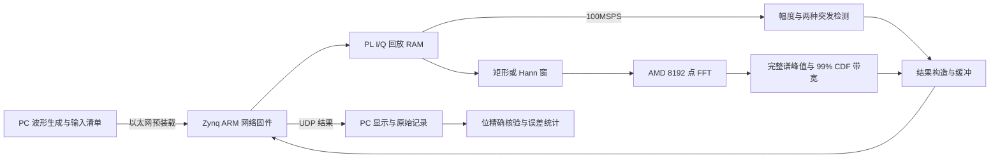

# 参赛演示提纲

本页配合 `第二阶段完整验收报告.md` 和 `第二阶段性能优化决策.md` 使用。指标以原始验收记录为准；照片、队伍信息和最终录像由参赛方补充。

## 一页硬指标

| 指标 | 已实现版本 | 验证口径 |
|---|---|---|
| I/Q 位宽 | 各 16 bit | 输入格式、RTL、实板读回 |
| 输入处理速率 | 标称 100MSPS | PC 预装载，板内 RAM 回放；每 10ns 一对 I/Q |
| FFT 长度 | 8192 | AMD 位精确模型、完整仿真与板测参考 |
| 分析时间 | 原完整套件最大 199.79µs | 首有效输入至频域结果；本轮新增矩阵最大值另见完整报告 |
| 频率精度 | 本轮适用单音最大误差 0.49001536 bin | 1 bin=12207.03125Hz；不是任意信号 1Hz 精度 |
| 带宽 | 整个 8192 点谱的 99% 占用带宽 | 本轮逐档 min/median/max 及最宽档 60 秒证据见完整报告 |
| 帧长 | 数字零模式与门限模式 | 零背景边界可精确；带噪门限效果另列适用范围 |
| 启动 | SD 网络固件 | 原实体 SD 读回和用户确认断电上电后的采集记录 |

时间、频率采用标称板载时钟，未使用计量校准设备。工程不含外部 ADC 或射频接收前端。

## 一页适用范围

| 输入条件 | 结论与限制 |
|---|---|
| 精确零背景 | 数字零模式按非零支撑区间测长；短间隔会按 gap_min 合并 |
| 带噪背景 | 数字零模式不适用；固定门限可能将多帧误合并 |
| 有已知前导静默区 | 主机对前 1024 点估计背景功率，配置固定迟滞门限后采集；不是 FPGA 在线自适应算法 |
| 独立验收 30/20/10dB | 各 100 个已知突发均匹配；各 99 个符合 ±32 点起止容差 |
| 独立验收 5dB | 100 个匹配，71 个符合边界容差；不能等同高精度分帧 |
| 独立验收 0dB | 100 个已知突发均未满足匹配规则，记录为适用范围失败 |
| 低幅、双音、频带边缘 | 单独保留状态和误差，不混入正常单音精度成绩 |
| 跨 Nyquist 边界 | 当前线性 CDF 不支持环绕最短占用带宽；排除出扩大带宽成绩 |
| 连续回放 | 重复同一 32768 点输入块，证明持续处理稳定性；不等同持续独立随机数据 |

## 原理框图

FFT IP 与厂商驱动属于第三方；回放控制、窗口衔接、检测、频谱统计、结果协议和验证工具的职责见源码与第三方声明。

## 演示顺序

1. 展示实际 Zybo Z7-20、SD、USB 和网线连接。启动网络固件，说明已保存的冷启动证据；若现场断电，应另存本次启动后的采集记录。
2. 运行正、负频点和非整数频点；解释 FFT bin 间隔以及量化误差。
3. 改变输入幅度，展示复包络峰值、RMS 与参考差异。数字码值不直接转换成未校准物理电压。
4. 同一突发分别展示门限测长与数字零测长；再展示噪声下固定门限误合并和前导静默区估计门限的结果。
5. 展示宽带分档 min/median/max，指出符号率、RRC 理想支撑、实际 99% 带宽的差别。
6. 展示最宽稳定档 60 秒连续结果，以及完整性、错误和逐条数值检查。
7. 展示 S4 两次实验无时序增益、S5 延迟分解和保留默认版本的理由，明确未实现 125MSPS。

每次只运行一个采集控制端，GUI 与资格验证脚本不要同时启动采集。重现矩阵时使用新输出目录，保留旧记录。

## 待参赛方补充的材料

- 队伍、成员及指导教师信息。
- 实际开发板接线照片；不能以框图或软件截图代替。
- 按赛事最终格式录制的演示视频与现场操作画面。
- 若赛方提供新补充规则，核对 AMD IP、板内回放与演示形式是否被接受。

本提纲是可直接使用的演示脚本，不代表照片和视频已经制作完成。
