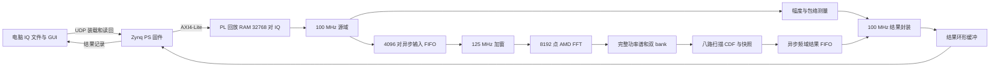

# 数字 IQ 分析器：最终电路设计说明

本文对应已完成真板、SD 和此次物理冷启动验收的第四阶段组合版本：100 MSPS、八路谱扫描、构建 ID `3bc7d0840b0602203141e9ee228e80e3`。bit/XSA/ELF/BOOT 与原始记录均在同一验收链中绑定。125 MSPS 实验未晋升。

## 1. 需求与测量边界

| 赛题项目 | 当前实现 | 验收含义 |
|---|---|---|
| I/Q 分量位宽不低于 12bit | 两路有符号 16bit | 数字格式，未声明模拟 ADC ENOB |
| IQ 数据速率不低于 100MSPS | PL 每 10ns 接收一对 IQ | 预装载后连续回放，网络只承担装载与结果传输 |
| FFT 不低于 8192 点 | 8192 点 AMD FFT | 全部输入参与计算，没有以显示快照代替 FFT |
| 接收 IQ 至频域信息不高于 2ms | 正常最大分析 175.23µs | 从窗口首个 IQ 的 PL 时间戳至分析完成 |
| 幅度 | 峰值、RMS | 原始数字 IQ 码值，未作电压或 dBm 标定 |
| 帧长度 | 门限突发或数字零背景波形区间 | 起点到结束点的 IQ 对数，不解析协议字节帧 |
| 频点 | 峰功率 bin 对应频率 | 宽带调制载频需另行定义和验证 |
| 带宽 | 全部 8192 点谱的 99% 占用带宽 | 两端各排除约 0.5% 功率，不等于频轴全跨度 |

用户已说明没有新的赛方补充要求。上述解释和需要确认的事项见[口径状态表](phase4_requirements.json)。它们是项目当前解释，不代表赛方已作正式认可。

## 2. 系统结构

PS 在采集前装载最多 32768 对 I16/Q16，完整读回核对后才启动回放。源域开始后每拍发出一对样本，不因 GUI 刷新或以太网查询而暂停采样。频域结果与时域上下文通过窗口编号配对，记录同时携带 epoch、配置 ID、首样本序号和时间戳。

主要实现入口为[外设](../rtl/iq_peripheral.sv)、[核心](../rtl/analyzer_core.sv)、[时域测量](../rtl/time_measure.sv)、[FFT 接口](../rtl/window_fft.sv)、[谱测量](../rtl/spectrum_measure.sv)和[结果封装](../rtl/result_builder.sv)。

## 3. 时钟、复位和跨域

源、AXI 控制和结果封装使用 100 MHz，FFT 与谱后处理使用 125 MHz。输入和频域结果分别使用 XPM 异步 FIFO，复位请求在源域寄存后同步进入 FFT 域。配置只允许在停止状态改变，启动时等待 FFT 配置完成与 FIFO 复位就绪。

快照完成窗口号通过 XPM 握手跨域，错误状态由同步寄存器传递。约束仅针对明确的同步器第一级设置例外，未使用整对时钟的全局假路径掩盖跨域问题。当前验收包含 setup/hold、CDC、内部端点覆盖、DRC 和 bus skew 检查。

当前源时钟与时间戳时钟相同，均为 100 MHz。FFT 125 MHz 不能写成 125 MSPS 输入。接口现已显式区分采样、FFT 和时间戳频率，并提供只读构建 ID 与安全跨域计数快照。RTL、通用向量/参考、主机和 SD 分析使用当前构建配置；固定 100 MSPS 的历史黄金夹具保留作为兼容参考。构建工具拒绝未验证的其他物理时钟组合。

## 4. 定点表示与 FFT

| 数据 | 表示与作用 |
|---|---|
| 原始 IQ | I16、Q16，有符号补码 |
| 原始瞬时功率 | I² + Q²，32bit 无符号可覆盖双负满幅 |
| 检测能量 | 16 点滑动和，36bit |
| FFT 输入和输出 | 每分量 24bit 定点 |
| Hann 系数 | 18bit，17 个小数位，查表 |
| FFT 旋转因子 | 18bit，收敛舍入 |
| 单 bin 功率 | 48bit 无符号 |
| 全谱功率和、CDF | 64bit |
| 幅度结果 | Q16.16，整数平方根和除法定义舍入 |
| 源时间戳和样本序号 | 64bit |

FFT 配置为 pipelined streaming、scaled、bit-reversed output、non-realtime。完整配置以[构建脚本](../scripts/create_fft.tcl)及实际 XCI 核验为准。Non-Realtime 的有效/就绪机制用于适配跨域供数，不能简单改成 Realtime 后假设输入气泡仍被忽略。

AMD FFT C 位精确模型用于生成逐点参考。浮点 FFT 用于解释算法相对于数学定义的误差，它与硬件位精确一致性是两种检查。

## 5. 幅度与突发包络

窗口或突发的峰值取原始 IQ 幅度最大值，RMS 取区间功率平均值的平方根。样本区间使用左闭右开 `[start,end)`，长度为 `end-start`。单位为 IQ 对数或由真实采样率换算的微秒。

threshold 检测比较 16 点滑动能量与不同的开启、关闭门限，并用 kon/koff 连续样本确认边界。legacy 默认参数保持历史行为。robust 为主机选择的明确档位：利用用户声明的 1024 点静默前缀估计背景，ton 为 `ceil(16×3×B)`，toff 为 `ceil(16×1.75×B)`，保留下限及迟滞，kon=16、koff=8。硬件仍运行相同检测 RTL，实际门限在采集元数据和 GUI 中显示。

digital-zero 检测数字非零区间，用 gap_min 确认零间隔，适用于确有数字零背景的输入。输入截断、未确认起点和超长分段都有显式标志。任何模式都不等价于任意通信协议帧同步。

## 6. 频域测量

谱测量先将 FFT 顺序映射到从负频到正频递增的 bin。对 ROI 外功率置零，累积全谱总功率并寻找最大值，等峰选择较低 bin。当前双 bank 每个 bank 分为八组，扫描每拍读取八个 bin，以 2/4/8 点平衡前缀流水计算 CDF。宽数据寄存器由有效标志保护，无需数据复位；控制、状态与有效标志仍复位。扫描中断复位后不得输出旧结果，已有专门测试。

设总功率为 T，低边界取累计功率首次达到 `ceil(T/200)` 的 bin，高边界取首次达到 `T-floor(T/200)` 的 bin。频率精确采用 `Fs/8192` 换算，最近整数 Hz，半单位远离零。带宽中心使用两个边界之和的一半。

显示快照每 8 个连续 bin 取最大值，共 1024 点。它用于绘图，不代替 8192 点谱的 CDF。零能量、FFT 溢出、ROI 边沿风险、分辨率限制和结果丢失分别置位。单音的矩形窗 99% 带宽可以为 0，此时应结合分辨率标志理解。

## 7. 计时定义和资源

分析延迟从窗口第一个被时域逻辑接受的 IQ 时间戳算起，至分析记录完成。板内环形缓冲发布还需要写入记录，当前正常最大分析/发布为 175.23/175.57µs。电脑发送 IQ、网络往返、保存文件和 GUI 绘图均不包含在这两个 PL 指标内。

当前八路组合实现：setup=0.199ns、hold=0.016ns，LUT14497、FF23768、BRAM92.5/140、DSP49。原四路为 183.41µs、LUT12866、FF20685、BRAM92.5、DSP53；系统最大分析延迟实测改善 8.18µs。没有将扫描段加速称为整体延迟减半。

## 8. 验收与新通信波形

第三阶段已有 524288 个 FFT 复数点的完整核心仿真、1653 组测量矩阵、基础板测、实际 GUI、匹配 SD 镜像和用户确认的物理冷启动。算法不检出或边界失败的输入仍保留，数值实现 PASS 不等于算法对每种输入都满足精度目标。

第四阶段 OFDM 采用 4096 点 IFFT、256 点循环前缀、QPSK/16QAM 数据与单位功率 BPSK 导频，DC 空置，所有子载波规则和增益先冻结。240 组正式矩阵与 24 组频移边界全部通过，并完成两档 10/60 秒及最终 300 秒持续验证。初始 95 MHz 设计跨度档的内部窗最小实际 99% 带宽为 93.786621 MHz。

随后预声明了 2010 个正频及 2010 个负频活跃子载波的次级实验，设计跨度为 98.14453125 MHz，每端保护带为 927734.375 Hz。使用全新训练 212000–212099 和独立 212100–212119，80 组有限板测通过，内部窗最小 99% 带宽为 96.997070 MHz。该组另完成 460 秒持续回放，最终组合版本对同一冻结输入复测通过。这个零频移档不能证明同等带宽在任意频移下都不过 Nyquist。

最终组合版本完成 2020 组矩阵、192 组矩阵前兼容检查和 36 项基础板测，OFDM 持续测试共 920 秒。全部正式性能来自同一构建，未改元数据或频轴缩放制造提升。详见[完整验收报告](第四阶段完整验收报告.md)、[测量汇总](phase4_final_measurements.json)与[次级有限矩阵](../captures/phase4_final_20260922/widest_finite/measurement_validation.json)。

## 9. 离线研究与限制

新噪声研究保存 3153 个不重复块，总长 1.03317504 秒，三个幅度层各自观察到零虚警；扣除估计前缀后的总长为 1.00088832 秒。每块重新估计背景并复位检测器，不覆盖连续块边界和漂移。9 个事先固定的抽样输入完成真板位精确检查。

900 例频点研究和 280 例半 bin 边界研究说明：单音插值可在明确模型下改善频率精度，但宽带谱峰通常不能代表载频。单音插值仍为离线结果，未占用当前 PL 延迟指标，也没有改名成硬件能力。

没有加入外部 ADC/高速数字接口、通用协议帧解析或自主 FFT 内核。是否需要这些功能仍取决于明确的赛事定义与硬件接口条件。

## 10. 自有逻辑与厂商组件

自有 RTL 负责输入回放、窗口控制、时域测量、数字零检测、谱后处理、CDF、定点结果计算、快照、AXI 寄存器和结果环形缓冲。AMD 组件负责 FFT、XPM 跨域/FIFO 和 Zynq PS 基础设施。固件沿用官方平台、PHY、lwIP/SD 驱动，自有协议实现配置、装载、读回和结果传输。独立参考与验收脚本分别验证数值和传输完整性。

这套职责划分可追溯到源码、实际 IP 配置和仿真输出，答辩时应明确说明使用了厂商 FFT。

## 11. 演示与复现

从工程根目录运行 `python scripts/phase4_demo.py`，菜单提供零背景测长、带噪 robust、单音峰频和 OFDM 预设。每个预设绑定向量 SHA-256、窗函数、检测模式及参数来源。每次采集生成独立结果目录，保留配置、记录、错误状态和快照。

验收脚本只有在构建、参考与实际板测匹配时才判为 PASS。打包必须保留相同版本的 bit/XSA/ELF/BOOT，SD 更新后完整读回核验；软件复位和物理断电上电分开记录。实际接线照片及录像应由真实拍摄提供，界面截图不能替代板卡接线证据。

早期调研中的 125 MSPS 是目标，当前稳定版为 100 MSPS。本文链接均指向当前工程的相对路径，早期 `D:/精英赛` 路径仅作为历史资料保留，不作为复现入口。
