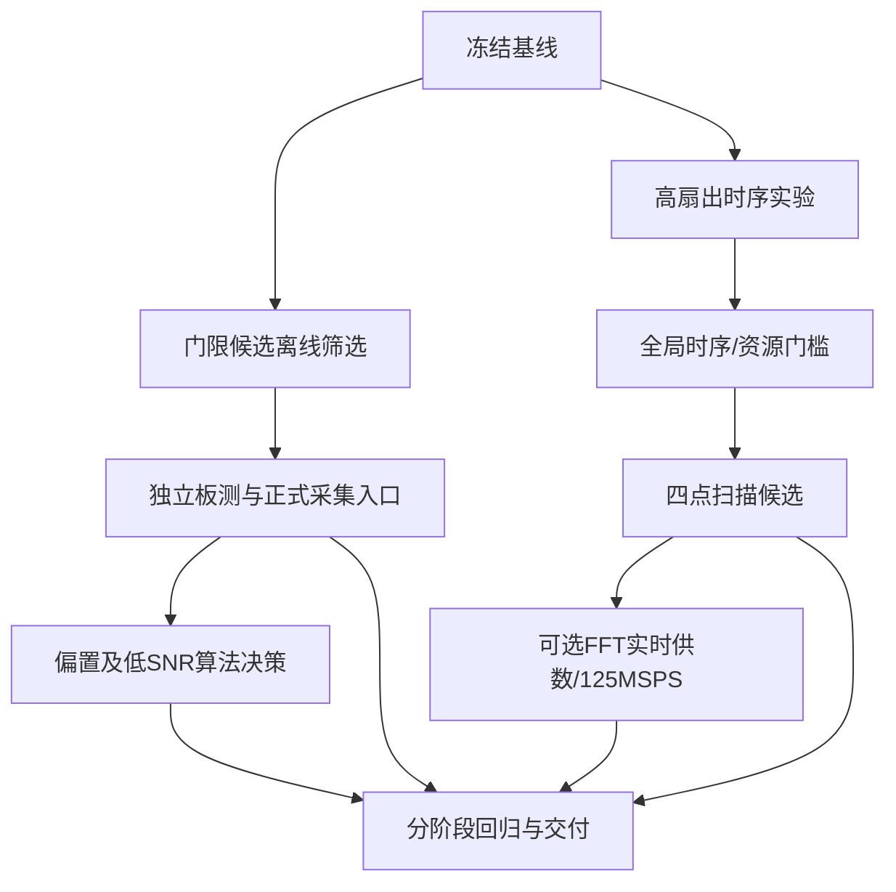

# 第三阶段优化实施方案：带噪测量、全局时序与延迟

编制日期：2026-09-21。基线提交：`c77bd2e4d0dc86e9057452190f09c6f5cd9fdf6c`。本文件中的新目标均是待验证的工程目标，不计为已有成绩。用户已要求执行后续优化并确认开发板连接；按下列顺序实施，条件性项目以进入条件和验收结果决定是否晋升。

## 1. 当前已经完成什么

依据 [第二阶段完整验收报告](reports/第二阶段完整验收报告.md)、[性能优化决策](reports/第二阶段性能优化决策.md) 和实际 RTL：

| 项目 | 当前事实 | 仍需改善之处 |
|---|---|---|
| 输入/FFT | I/Q 各16位，板内100MSPS，8192点，FFT时钟125MHz | 默认保持，提频独立验证 |
| 验收 | 第二阶段新增466组；2686315条频域、672013条突发逐条通过 | 新功能需增加新参考和回归 |
| 频率 | 312个适用窗口最大误差0.49001536bin | 不优先投入亚bin估计 |
| 带宽 | α=1.0、Hann：81.250000～82.043457MHz；已完成60秒 | 不以频轴100MHz宣传有效带宽 |
| 带噪匹配 | 30/20/10dB各100/100匹配，99/100正常；5dB为100/100匹配、71/100正常；0dB为0/100匹配 | 先改善5dB边界，再研究0dB能力 |
| 偏置 | (512,-512)、低幅256码漏检；幅度1024边界不满足容差 | 区分DC估计与实际信号分量 |
| 时序 | setup/hold 0.030/0.004ns；两次常规物理优化无收益 | 针对FFT内部高扇出路径 |
| 资源 | LUT12359，FF20030，BRAM90.5/140，DSP53/220 | 新缓存和并行扫描按实际映射核算 |
| 延迟 | 原完整套件最大分析199.79µs；新矩阵199.78µs | 分阶段测量后择优优化 |
| 冷启动 | 原启动版本已有SD读回及用户确认断电后的采集证据 | 新BOOT必须重验 |

冻结交付包 `release/phase2-complete-20260921.zip` 的 SHA-256 为 `70b2f6080b50a15426f97402dda94960dfd004364733cdd56eea64e2aea0683b`。本轮基线归档位于 `build/phase3_baseline_20260921/`。旧报告、旧包和原黄金结果保留。

## 2. 优先级、成果和决策门槛

| 阶段 | 优先级 | 工作 | 可交付结果 | 初步工作量 |
|---|---|---|---|---|
| P0 | 必做 | 冻结基线、规划新seed、明确指标 | 归档、样例定义、记录格式 | 0.5人日 |
| P1 | 必做 | 现有门限算法的离线筛选和独立板测 | 新门限档位、边界/漏检/虚警统计 | 1～3人日 |
| P2 | 必做 | 将合格参数接入正式采集入口 | CLI/GUI实际配置、读回和元数据 | 1～2人日 |
| P3 | 必做实验 | 针对关键高扇出网络的时序优化 | 候选或有证据的无收益结论 | 1～3人日 |
| P4 | 条件性 | 每拍四点频谱扫描 | 数值等价的低延迟候选，或回退结论 | 2～4人日 |
| P5 | 条件性 | DC稳健检测、可选更长能量窗 | 独立算法/硬件模式或适用边界结论 | 2～4人日 |
| P6 | 可选探索 | FFT实时供数与真实125MSPS | 新档位完整验收或失败分析 | 3～6人日 |
| P7 | 必做 | 回归、打包、演示和必要启动验证 | 新交付包、报告、指标表 | 1～2人日 |

估时不是日历承诺。优先形成P1/P2的软件能力交付；P3/P4另形成硬件候选。P5/P6不以“必须成功”为条件，必须留下评估及进入/不进入依据。一次只变一个关键因素，避免同时更换检测算法、FFT模式和采样率而无法归因。

## 3. P0：证据和实验边界

1. 在 `optimization/phase3-robustness-performance` 实施；源码快照、原报告/日志、产物和冻结ZIP保存散列。
2. 新输入、参考、采集分别使用唯一目录；原 `data/vectors/` 和四个黄金文件保持不变。
3. 第二阶段已经用于观察失败与选择方向，属于已知回归集，不能重新标为本轮独立验收集。
4. 新参数只在训练seed上选择；独立seed只用于冻结候选后的验收。若验收失败后继续调参，已看过的数据转为回归集，再设新的留出集。
5. 每例记录输入SHA、原始/量化后SNR、偏置、窗、门限、确认点数、实际寄存器、epoch/config_id、产物身份和源代码散列。
6. 当前校验工具有100MSPS、版本0x00010001及参考绑定限制。扩展时增加显式能力和参考版本，不删除检查来兼容新版本；历史校验在冻结代码中仍可复现。
7. `tests/`、`host/`、RTL或仿真输入发生变化后，按影响范围刷新真实测试记录；不手工改旧PASS。只新增实验分析脚本时不无故重跑整套硬件实现。
8. 板测只允许一个采集控制端；每轮结束检查停止状态和错误寄存器。失败原始数据保留。

## 4. P1：现有门限算法优化

### 4.1 用实际误差确定方向

当前16点滑动能量检测使用严格 `sum > ton` 和 `sum < toff`，kon/koff=8/32。前1024点静默区估计背景功率B，然后ton≈16×4B、toff≈16×2B。

独立结果中，5dB起点误差中位数20.5点、最大119点，结束误差中位数10点，因此不能用统一“减15点”修正长度。30/20dB长度偏差中位数+15点，但个别结束偏差+46点，反映滑动窗尾部和连续关断确认共同作用。

对零均值、无偏置且背景估计可靠的模型，0dB活动期平均总功率约2B，低于当前4B启动门限；5dB平均约4.16B，接近启动门限。这是算法层面的量级解释，不是对随机波形每点能量的保证。优先研究启动门限与确认长度的折中。

### 4.2 筛选范围和执行顺序

保持M=16及RTL不变，先筛选：

| 参数 | 首轮候选 |
|---|---|
| 背景估计 | 原均值；分块均值中位数作为候选，必须单独命名 |
| α_on | 2.0、2.5、3.0、3.5、4.0 |
| α_off | 1.25、1.5、1.75、2.0；只取α_off<α_on |
| kon | 4、8、12、16 |
| koff | 8、16、24、32 |
| 静默区 | 主验证1024点；敏感性256/512/2048点 |

先在少量训练seed粗筛，保留至多12个候选，再对完整训练集评估，最终至多3个候选上板。允许保留“保守”和“低SNR”两个固定档位，避免按每例真值选最佳参数。原默认档位保留。

建议训练seed从110000开始，独立验收从120000开始；写入清单后冻结。重点SNR为30/20/10/5/0dB，主幅度8192、每输入4个4096点突发；再补64/512点短帧、低幅和偏置。新矩阵以实际运行清单为准，任何删减说明原因。

实际执行调整：在训练前将新训练和独立主验证幅度设为4096码，以增加0dB噪声下的int16余量，不按seed是否溢出进行筛选。原8192码数据完整保留为已知回归，并在相同输入上对照原参数和robust参数；不能将两种幅度混作直接独立前后比较。最终主要独立验收采用125个seed×4个突发，即每SNR500个突发。

### 4.3 指标与目标

- 硬门槛：硬件逐字段符合声明定点算法；无缺样、记录丢失及未解释错误。
- 正常匹配定义沿用旧规则：一对一、至少50%真值重叠，起止各≤32点且无误合并/拆分。
- 30/20/10dB：争取正常率≥99%，且在相同回归集上不弱于原档位。
- 5dB：争取正常率≥95%；同时报告长度绝对误差P95和最坏起止误差，不能只提高重叠匹配率。
- 0dB：探索目标，不承诺成功。检测率提升必须与背景虚警和误拆分一起评价。
- 每个主要验收工况至少100个已知突发；最终候选优先扩至500个，按独立输入seed分组报告，不把同一块4个突发简单当完全独立试验。
- 相同独立纯噪声集上，候选的背景虚警不能因提高检出率而被隐藏；报告ROC/候选对比，不只展示最优点。
- 失败案例进入专门目录，保留输入与检测区间。不可把未检出例从误差分母移除而不报告。

### 4.4 纯噪声与静默区污染

现有AWGN生成器按活动信号计算SNR，不能直接生成有噪的全零参考。需要显式增加“噪声均方功率”规格，纯噪声的SNR字段为空，真值突发数为0。验收数据涵盖背景强度变化、少量静默区污染和噪声功率缓慢变化。

第一轮至少256个独立32768点噪声块，原始独立背景时间仅0.08388608秒；1024块也只有0.33554432秒。循环重复同一块60秒仅证明运行稳定，不增加独立噪声覆盖。零观测虚警必须同时给出实际观测时长，不能宣传长期虚警率为零。若要建立更强统计结论，另增加独立样本量并明确统计假设。

训练前固定“静默区被污染”的处置：拒绝自动估计、标记估计不可信，或使用已经声明的稳健估计；不得根据后面的帧真值决定前导区是否有效。无静默区时需要人工参数或独立模式，禁止假装已经自动估计成功。

## 5. P2：把验证能力接入正式采集工具

当前 `qualification_capture.py` 用限定作用域的Client替换设置门限，正式CLI/GUI仍以固定配置为主。下一步将参数配置集中到一个正式入口，资格验证复用它。

1. CLI增加显式ton/toff/kon/koff和门限档位；参数单位必须显示为16点能量和采样点数。
2. 统一检查整数范围、0≤toff<ton<2^36、确认长度有效值；显式拒绝冲突选项。
3. CONFIG后、START前读回门限、模式、回放和窗配置；不一致时不启动采集。
4. 元数据保存请求值、计算值、实际值、估计区间、背景估计、档位及算法版本。
5. GUI展示固定门限/前导静默区估计、估计区间和实际生效参数；只添加会实际写入硬件的控件。
6. 旧命令默认行为与旧13/15字配置兼容；为新字段建立明确协议版本或能力判断，不让旧板误解新配置。
7. 覆盖边界值、非法参数、硬件读回不一致、旧记录打开和多次启动停止。正式入口通过与资格验证相同的一组真板输入核验。
8. 新入口没有改变波形、只改变阈值时，可以保持现有BOOT。主机源码变化仍需相应回归和新来源记录。

## 6. P3：针对性全局时序优化

### 6.1 避免重复无收益实验

瓶颈是FFT内部 `ce_w2c` 网络，扇出10489、关键布线延迟约6.960ns。之前AggressiveExplore在正裕量条件下没有改善；单纯再跑相同命令不能视为新优化。

AMD Tcl文档提供对指定网络强制复制驱动的选项，可不依赖负slack触发。其在当前Vivado、器件、检查点和厂商IP层级中的适用性，必须先通过本机 `help phys_opt_design` 和实际实验验证。[AMD UG835：phys_opt_design](https://docs.amd.com/r/2023.2-English/ug835-vivado-tcl-commands/phys_opt_design)

### 6.2 受控实验

| 实验 | 唯一主要变量 | 条件 |
|---|---|---|
| T1 | 对明确识别的ce_w2c进行工具驱动复制 | 网络唯一、驱动/负载明确，工具允许 |
| T2 | 从综合检查点重新布局，采用本机支持的性能策略 | T1不足时运行；保持真实时钟约束 |
| T3 | 合法的逻辑位置/扇出组织调整 | 只改已证实相关的自研外围；先证明等价 |

使用独立输出目录保存前后路径、扇出、资源、CDC、DRC、bus skew和checkpoint。不要编辑生成的厂商HDL或网表文件；工具在内存中的合法物理优化属于候选实现。若IP保护/DONT_TOUCH阻止优化，记录拒绝原因，不强行解除保护去追求成绩。

不得放宽时钟周期、添加无依据false path/multicycle或忽略CDC以获得正裕量。不得把局部路径改善当全局改善。变更一个实验变量后先评估，再决定下一项，不进行无界策略穷举。

### 6.3 晋升条件

- setup/hold均非负、无未约束内部端点、CDC Critical=0、DRC无Error、bus skew满足约束。
- 争取全局setup≥0.10ns；若仅改善少量，必须明确收益和重复实现的一致性，不承诺0.10ns。
- 资源增幅应可解释；以BRAM总占用不超过约75%作为内部预警线，超出需要收益说明，不以估算替代报告。
- 必须重新导出相互匹配的bit/XSA、软件和BOOT，完成原功能及新增矩阵板测，才能替换默认产物。
- 未达晋升条件时默认版本保持原样，保留失败分析；这不阻止P1/P2软件能力交付。

## 7. P4：四点扫描低延迟候选

### 7.1 目标与进入条件

当前扫描约32.792µs；每拍4点的主体理论节省约16.384µs，不能称系统总延迟减半。争取同一输入集合最大分析延迟<190µs。优先在P3形成可用时序候选后实施；即便P3收益不足，也可做隔离的资源/时序可行性实验，但不得预先替换默认实现。

### 7.2 RTL修改范围

`rtl/spectrum_measure.sv` 将每个谱bank的偶/奇分组扩展为4个q低两位分组，每组2048点；保留双bank占用规则。每拍四点前缀和分级寄存，读地址、q索引、帧尾、有效位保持对齐。

- CDF阈值保持ceil(total/200)与total-floor(total/200)；按四点中最早达到阈值的位置确定边界。
- 同峰选择最小q；零功率、ROI屏蔽、首末bin定义不变。
- 1024点快照仍以8个谱点取最大值；四点扫描下应每两拍合并，不能悄悄改变快照意义。
- 所有64位累加和比较的流水级数计入时延；bank释放与结果发布必须和原接口一致。
- 不直接把RTL数组容量当BRAM数量，必须检查综合后的RAM映射和路由后时序。

### 7.3 验收矩阵

原16组合完整524288点FFT逐位一致；增加CDF边界落在四点内位置0/1/2/3、零功率、全能量集中首末bin、等峰跨分组、ROI边界、连续bank切换、快照请求在各状态到达、有效气泡和最后一窗结束。

结果中的频率、功率、带宽、幅度、状态、序号逐位等价；时戳和延迟按新的正确周期重新建模。持续100MSPS不回压丢样，60秒正常采集无丢记录。若总延迟未低于190µs、时序失败或资源代价过高，保留候选结果并回退。

## 8. P5：偏置与更低SNR的条件性研究

优先评估P1/P2是否已经满足选定演示场景。仅在仍有明确收益时增加硬件模式。

### 8.1 DC估计

仅使用明确静默区估计μI、μQ及去均值后的噪声功率。检测支路可用(I-μI)^2+(Q-μQ)^2，原始频谱、幅度和能量继续按声明的原始输入口径统计；若增加去DC测量，应另列字段并明确0Hz信号的意义。

不能盲目对整个输入减均值：可能删除合法DC单音或改变频谱成绩。主机预处理后的文件若重新上传，应同时保存原始与处理后的SHA，并明确证明的是处理后输入，不当作板内DC补偿已经实现。

减法可能需要17位有符号输入，功率和滑动和须重新推导最坏位宽；跨域配置μ值只能在停止状态更新。检查饱和、负满幅、估计偏差、温漂模拟和静默区污染。新的检测模式必须在寄存器/固件/客户端/参考中完整贯通。

### 8.2 能量窗长度

可离线比较M=16/32/64，分析低SNR识别与短帧边界的矛盾。M增大会改变起止偏差、确认行为及最小可分间隔，不能直接延用旧门限和“32点容差全部适用”的宣传。扩大累加位宽和寄存器字段前核对硬件接口；未通过独立验收则保持M=16。

本阶段不默认引入协议前导匹配或在线CFAR，它们需要明确输入协议/噪声模型与单独预算。若0dB的检出率与虚警无法兼顾，应交付不适用结论。

## 9. P6：FFT实时供数与125MSPS

### 9.1 先研究供数，不能只改IP选项

当前FFT为Non-Realtime，100MHz输入经4096深异步FIFO进入125MHz FFT，会存在供数空拍。AMD说明Realtime模式开始装载一帧后不再按输入TVALID插入等待，缺数可能破坏帧，因此不能直接切换 `throttle_scheme`。[AMD PG109：Controlling the FFT Core](https://docs.amd.com/r/en-US/pg109-xfft/Controlling-the-FFT-Core) [缺数事件说明](https://docs.amd.com/r/en-US/pg109-xfft/event_data_in_channel_halt)

若研究Realtime，先设计整帧缓存和供数调度，明确8192点连续供给、双bank切换、配置时机及结束刷新。现有4096深FIFO不是一帧缓存。核算BRAM与新增首帧等待，比较最大分析延迟，不能只看FFT输出段缩短。

若缓存代价或延迟增加抵消收益，则维持Non-Realtime。FFT内部 `ce_w2c` 的存在不证明外部可选aclken已启用，也不能通过删除端口假设内部网络消失。

### 9.2 125MSPS进入门槛与联动变更

仅在100MSPS候选已经封存，持续吞吐仿真、时序与资源满足要求时进入独立档位。前置研究不满足则形成失败分析并结束该分支。

- 必须改变实际采样时钟，检查FFT服务率与长期FIFO水位；不能只改元数据。
- 统一参数化RTL频率换算、时间戳时钟、门限时间意义、固件、GUI、FFT参考、向量及验收入口。
- 当前 `result_builder.sv` 的100MHz常量及频率比例、`FFTReference` 的100MSPS限定均需明确改造。
- 125MSPS下bin间隔=15258.7890625Hz，8192点窗口=65.536µs；时间戳若使用125MHz则2ms=250000拍。
- 32点确认由320ns变成256ns；必须决定维持点数还是维持时间，随能力档位保存。
- FFT仍125MHz时长期服务余量有限；提高FFT时钟也需重新实现和验收，有限FIFO不能弥补平均吞吐不足。
- 完成原功能、宽带、边界、60秒连续、压力/恢复、SD读回与新冷启动后才能发布新档位。

## 10. 版本和回归原则

软件门限档位且不改RTL时沿用已验收硬件，重新生成主机/资格验证的来源记录。只改实现策略也必须重新绑定新bit身份和对应XSA/软件，不沿用旧板测证明新bit。

若增加寄存器、检测模式或采样率，定义新硬件版本与能力位；客户端遇到未知/不兼容能力应显式报错。建议增加只读构建ID：由构建前源码和配置生成，在发布清单中绑定最终bit散列；不能声称构建ID就是bitstream自身的SHA。

| 变更 | 最低验证 |
|---|---|
| 报告/离线分析工具 | 数据绑定、统计复核、旧包完整性 |
| 正式主机配置 | 参数/协议测试、实际读回、新旧有限板测、来源刷新 |
| 检测RTL | 检测独立仿真、核心/AXI/主机回归、真实矩阵、静态时序 |
| 频谱扫描 | 边界/快照/双bank、全FFT及记录一致、全套板测、60秒 |
| FFT/IP/时钟 | 显式重建IP和板级工程、完整参考/仿真/实现/软件/BOOT/启动验证 |

正常性能与主动注入故障分开统计。故障测试要求明确检测和恢复，不能要求故障注入时错误数为零。

## 11. 预计代码位置与交付物

以下新增文件是职责规划，实施时允许合并，不提前将路径视作已实现：

| 位置 | 工作 |
|---|---|
| `scripts/phase3_*` | 候选筛选、独立规格、实验与汇总；记录脚本散列 |
| `tests/threshold_reference.py`、生成器 | 保留原算法，增加明确版本的候选/纯噪声规格 |
| `host/iq_client.py`、`host/monitor.py` | 正式门限参数、静默区估计、配置读回、元数据 |
| `scripts/qualification_capture.py` | 移除临时Client替换，复用正式配置路径 |
| `scripts/verify_board_capture.py` | 新能力显式支持，旧规则保留 |
| `rtl/spectrum_measure.sv`及相关测试台 | 条件性四点扫描与等价验证 |
| `rtl/time_measure.sv`、外围寄存器 | 条件性DC/新能量窗，不覆盖默认模式 |
| `scripts/create_fft.tcl`、板级构建 | 仅在新IP/时钟实验需要时变更 |
| `scripts/record_build_stage.py`、打包工具 | 精确绑定新代码/配置/数据，不放宽旧验收 |

每个候选交付参数清单、训练/验证划分、原始输入/采集、统计JSON/CSV、前后对照和接受/拒绝结论。最终交付保留一个默认稳定档及已验收可选档，失败checkpoint单独标记。

## 12. 停止条件和首轮具体执行清单

出现数值不一致、正常丢样、负时序、未解释CDC/DRC、参数未写入、身份绑定失效，候选不得晋升。失败后定位一次明确原因，再决定修复或退回，不在证据失效时继续批量采集。

首轮执行：

1. 冻结c77bd2e和完整交付包，确认板卡空闲无错。
2. 建立新训练/留出seed与背景噪声集，离线比较现有门限候选。
3. 在独立checkpoint上验证本机强制复制选项，对准确识别的高扇出网络做一次受控实验。
4. 冻结门限候选，接入正式采集路径，运行对应测试和独立板测。
5. 根据P3结果决定四点扫描的实现与晋升；根据P1结果决定DC/能量窗研究范围。
6. 输出每阶段实际完成状态，再执行整体回归与打包；不以“完成首批”为理由自动终止已经进入且可继续的必做工作。

实体SD更新只发生在新硬件候选完整验收后。物理断电、实物照片和最终演示录像需要真实操作；如工具无法完成，在其余工作完成后明确请求用户协助，不能以软件复位冒充冷启动。

参赛材料继续采用 [参赛演示提纲](reports/参赛演示提纲.md)，更新真实指标和限制。用户未要求发布远程仓库时，先完成本地提交及独立交付包。
