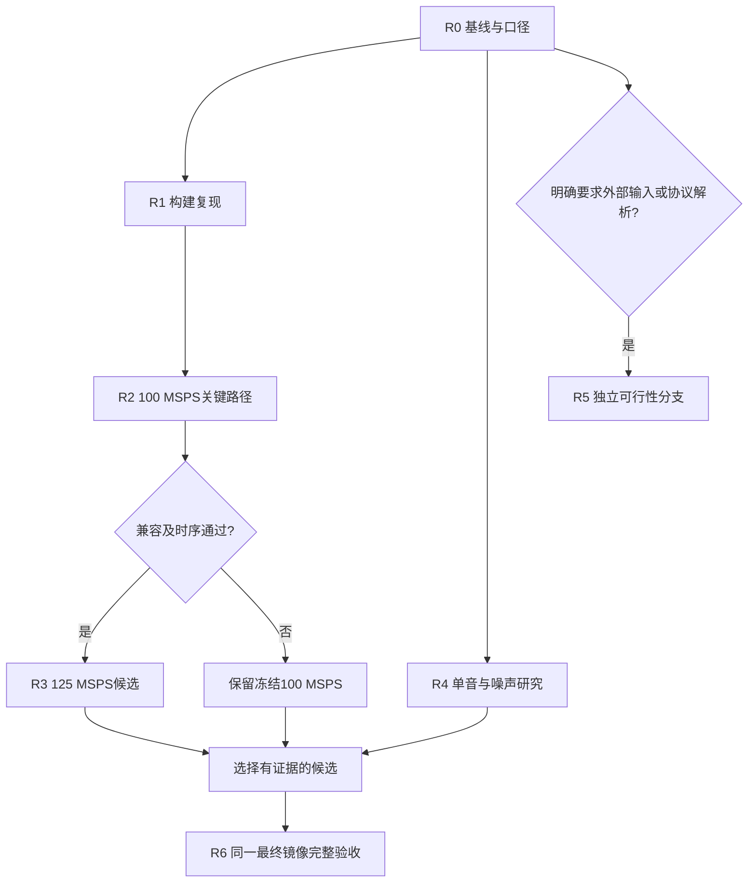

# 第五阶段优化实施方案：测长关键路径、125 MSPS可行性与测量可信度

编制日期：2026-09-28。状态：待实施方案；文中新增目标均不是已有成绩。

本方案以本地收尾提交 `996b1ddf845b32eecfea6ad989f546e3ec8494f2` 为源码基线，以第四阶段已验收镜像为硬件基线。本次仅编制方案，不启动构建、改写板卡或更新SD。

## 1. 推荐的下一步

当前有明确数值门槛的比赛指标已达到。下一轮应优先解决“结果如何被认可、改动如何不破坏已验收能力”，随后争取超过100 MSPS的实际处理速率。现有96.997070 MHz带宽已接近100 MSPS复数输入的全频轴范围，继续挤压保护带的价值小于解决实际提频瓶颈。

建议主线：**冻结与口径清单 → 构建复现 → 100 MSPS下测长关键路径优化 → 125 MSPS可行性 → 合格候选完整验收。**

测量精度采用独立支线：先验证单音亚bin估计和噪声失效边界，只有收益明确才加入板端。十六路扫描、DDR长回放、外部输入、协议帧同步、自研FFT均设进入条件，不把所有方向同时列为必须交付。

| 层级 | 工作 | 本轮预期成果 |
|---|---|---|
| 必做 | 基线、赛事定义、构建复现、延迟/时序分析 | 可复核的基线和明确的实验取舍 |
| 优先硬件候选 | 数字零测长关键路径优化 | 100 MSPS保持原数值，增加时序余量 |
| 主要性能候选 | 125 MSPS及配套时钟/服务率验证 | 通过则成为可选档；失败则保留100 MSPS并交付拒绝依据 |
| 独立测量候选 | 单音频率细化、噪声与背景漂移研究 | 明确适用输入、误差、拒绝条件和额外耗时 |
| 条件性架构扩展 | 外部持续输入、DDR、协议解析、自研FFT | 仅在赛方定义或已确认接口需求触发时立项 |

## 2. 当前基线与保护目标

| 项目 | 已验收事实 | 下一轮保护要求 |
|---|---|---|
| 平台 | Zybo Z7-20 / XC7Z020 | 默认沿用现有板卡 |
| 输入 | I16/Q16，100 MSPS预装载回放 | 不缩减位宽、漏样或暂停输入来提高成绩 |
| 计算 | 8192点AMD FFT，125 MHz计算域，八路谱扫描 | 保留全部频点、原CDF和快照语义 |
| 分析/发布延迟 | 正常最大175.23/175.57 µs | 相同定义、同一最终镜像比较 |
| 指定最宽OFDM | 内部窗最小99%带宽96.997070 MHz | 不用设计跨度、最高单窗或跨界混叠替代 |
| Setup/Hold | 0.199/0.016 ns | 合法约束；无严重CDC、无未约束内部端点 |
| LUT/FF/BRAM36/DSP | 14497/23768/92.5/49 | 以实现报告统计，BRAM当前66.07% |
| 带噪测长 | 30/20/10 dB各500/500正常；5 dB为496/500；0 dB为0/500 | 保留失败输入，不把数值一致性当检出率 |
| 冻结硬件验证 | 2020组矩阵、192组兼容检查、36项基础板测、SD及物理冷启动 | 新硬件不自动继承这些资格 |
| 新版上位机 | 9月28日18项回归、4项实板数值核验通过 | 原参数、数据、状态与历史记录入口继续可用 |

硬件构建ID：`3bc7d0840b0602203141e9ee228e80e3`。接口版本：`0x00010002`。

收尾包：`release/phase4-closeout-20260928.zip`，944750162字节、30990个文件。

```text
SHA-256: 57983410620aa938683d3bc05374d0045ba2e733e8e39f3b9f00a7990a871de4
```

依据：[第四阶段完整验收](reports/第四阶段完整验收报告.md)、[本次收尾记录](reports/closeout_20260928/收尾验收说明.md)、[包校验回执](release/phase4-closeout-20260928_check.json)。

## 3. 新增目标与晋升规则

以下数值是工程筛选门槛，不是赛题新增要求，也不承诺对应某个分数。

| 方向 | 争取目标 | 必须同时满足 |
|---|---|---|
| 100 MSPS时序优化 | Setup≥0.40 ns | Hold≥0、全部数值及检测语义兼容；分析最大≤175.50 µs；解释新增流水延迟 |
| 125 MSPS档 | 实际连续接受125 M对IQ/秒 | Setup≥0.10 ns、Hold≥0；无正常丢样/溢出；完整速率元数据和新参考 |
| 125 MSPS延迟 | 正常最大分析≤150 µs | 这是性能目标；若达不到，按速率收益与实测延迟单独决定是否保留可选档 |
| 125 MSPS宽带 | 预声明OFDM内部窗最小99%带宽≥115 MHz | 新量化IQ、独立seed、真实125 MSPS镜像，不能只把旧成绩乘1.25 |
| 100 MSPS低延迟支线 | 最大分析≤172 µs，改善至少3 µs | 只在时序、资源与全部测量无退步时晋升 |
| 单音细化 | SNR≥20 dB时绝对误差P95≤0.05 bin，最大≤0.10 bin | 适用单音中有效输出率≥99%；拒绝和失败均进入统计 |
| 长噪声研究 | 每幅度层争取≥3秒有效独立噪声 | 分别报告重置分块/连续状态，虚警按真实暴露时间计算 |

125 MSPS的单窗样本覆盖时间为65.536 µs，频率格为15.258789 kHz。输入更快会让同样8192点的频率格变粗，因此提速和单音精度必须分别报告，不能把更高采样率称为频率分辨率自动提高。

默认正式镜像只在完整验收后替换。候选未达工程目标但满足题面最低门槛时，保存实测结果，评估是否有实际收益；不为宣称“所有优化完成”而强行晋升。

## 4. 阶段与依赖

| 阶段 | 内容 | 依赖 | 交付物 | 估计投入 |
|---|---|---|---|---|
| R0 | 口径、基线与实验规格冻结 | 无 | 口径表、基线清单、预声明测试矩阵 | 0.5～1人日 |
| R1 | 构建复现和证据范围整理 | R0 | 本工程内的软件构建与来源核验；历史依赖清单 | 1～2人日 |
| R2 | 测长确认/写使能关键路径优化 | R0、R1 | 100 MSPS兼容候选与时序前后对比 | 2～4人日 |
| R3 | 125 MSPS实现与连续服务率筛查 | R2通过 | 合格提频档或明确停止报告 | 3～5人日 |
| R4 | 频点与噪声测量支线 | R0；板端实现依赖R2/R3选择 | 浮点/定点/板端误差、能力标志 | 离线1～2人日，板端另2～4人日 |
| R5 | 外部输入等条件分支 | 明确接口/赛事需求 | 单独可行性方案，必要时重估范围 | 不计入主线；另估 |
| R6 | 最终组合、验收与演示 | 所有拟晋升候选冻结 | 仿真、板测、启动、交付及答辩对照 | 2～3人日 |

工期是工程人日估计，不是运行计时承诺；完整仿真和布局布线可能增加等待。建议主线预留约9～15人日；涉及板端新算法再预留额外时间。未知赛期按两档执行：剩余≤5个工作日只做R0/R1和现有版本演示；时间充足才进入新硬件。



## 5. R0：确认哪些优化真正影响比赛认定

### 5.1 六个具体问题

| 待确认事项 | 当前解释 | 对下一步的影响 |
|---|---|---|
| IQ输入能否由板内预装载回放提供？ | 接收端实际每拍处理一对IQ | 若要求外部新数据，R5成为主线前置条件 |
| FFT能否使用厂商IP？ | AMD FFT，自有控制和测量RTL | 若必须自研，另起架构项目，重新估时 |
| 帧长度按什么边界？ | 突发包络的样本区间 | 若要求协议帧，必须取得协议和帧格式 |
| 频点是谱峰还是调制载频？ | 谱峰，带宽中心另列 | 若要求载频，选择已知信号模型设计估计器 |
| 带宽采用什么定义？ | 99%占用带宽 | 若指定其他定义，增加独立字段和参考 |
| 时延从哪到哪？ | PL首个IQ被接受到分析记录完成 | 若要求端到端，应另外量测上传、处理、回传与显示 |

整理成一页确认清单，由参赛者向赛方确认。保存答复原文、来源、日期和受影响条目；未回复时维持“未确认”，不能写成“已认可”。本方案不自动对外发送消息。

### 5.2 实验冻结

复核基线ZIP和关键bit/XSA/ELF/BOOT散列；记录工具/IP版本、XCI、真实时钟、Git提交及未跟踪文件。保留当前SD可用镜像和恢复入口。

采用独立候选目录和分支，例如 `optimization/phase5-timing-rate`。优先复用合适的空闲工作区；涉及新构建时避免污染正在使用的正式工程。真板、JTAG、SD维护同一时刻仅允许一个控制流程。

新数据集预留训练310000～310999、留出311000～311999、备用312000～312999。生成前检索全部既有规格确认未使用，并记录PRNG种类、版本、输入散列。已查看过的独立集一旦用于调参，就转成回归集，改用新的留出集。

## 6. R1：让新候选能够在主工程内独立构建

现有软件/SD维护记录仍引用 `D:\fft\iq_phase4_combined`。目前可使用冻结镜像和完整包，但删除该目录可能破坏来源检查和维护流程。

实施顺序：

1. 列出所有运行时读取的外部路径，区分“历史说明”与“实际需要的构建文件”。历史记录保持原样。
2. 在候选工程用当前XSA建立新的 `build/vitis_<xsa散列前缀>`，重新生成平台及固件；避免修改全局Vitis安装。
3. 新报告同时保存原采集路径、项目相对路径和散列。读取项目内证据时优先相对路径，不能仅靠文件名推测来源。
4. 用文件访问清单或构建日志证明新构建、校验和SD维护入口不再读取旧候选目录；测试时使用新的隔离目录，不删除旧目录来制造条件。
5. 若重新链接导致ELF或BOOT字节变化，就按新软件候选重新板测与启动验证，不能沿用旧BOOT散列。

另需建立清晰的验证层次：硬件实现输入、固件/通信协议、GUI显示、文档和交付内容分别绑定。原完整仿真门禁继续保留；新范围门禁必须拒绝超范围变更。仅文档或界面更新可采用对应范围验证，RTL、FFT配置、固件或协议变化必须触发相应完整验证。

验收：新候选构建不依赖旧实验目录；新位置的五类信号离线显示和证据核验通过；所有参与运行的代码及产物均能追溯。旧目录在依赖迁移完成和备份核对前保留。

## 7. R2：首先改数字零测长关键路径

### 7.1 已定位的瓶颈

当前100/125 MHz组合最差路径为 `gap_min` 到 `digital_detector/burst_data` 的写使能：13级逻辑，数据路径9.190 ns，布线约67.1%，setup仅0.199 ns。旧125/125 MHz候选同类路径为11级、7.591 ns，setup0.029 ns，未达到0.10 ns的内部晋升门槛。

依据：[当前关键路径](reports/worst_paths.rpt)、[时钟可行性结论](reports/第四阶段时钟可行性结论.md)。实际源码入口为 [digital_burst_measure.sv](rtl/digital_burst_measure.sv)、[time_measure.sv](rtl/time_measure.sv)、[iq_peripheral.sv](rtl/iq_peripheral.sv)。

### 7.2 两次有界结构实验

**候选A：启动时锁存和预计算。** 对本次采集固定的 `gap_min`、`max_burst` 生成明确宽度的派生值，检查 `gap_min-1` 等表达式是否因无尺寸常量而扩展运算宽度。前提是配置在运行中被锁定；先用AXI测试确认这一点，再把组合计算从逐样本关键路径移到启动准备阶段。

**候选B：事件判定与288位记录封装分级。** 在检测状态机内生成结束/超时事件及完整上下文，下一拍完成宽记录写入；按需要对控制使能局部复制以降低扇出。样本计数、起止坐标、能量、峰值、标志、burst_id随事件一起对齐，不能只延迟valid。

必须保持每个有效样本一拍的接受能力。增加流水后重算 `finish` 排空条件和STOP完成条件，检查连续事件、短突发、复位中断时不会漏发或多发。`gap_min`确认与最大长度同时到达时，仍保持“确认结束优先”的旧规则。

### 7.3 定向测试矩阵

固定测试至少覆盖 `gap_min={1,2,31,32,33,65535}`、`max_burst={1,2,31,32,33,8192,1048576}`，两者42种组合。每种包含短于/等于/长于确认间隔、单点非零、内部短零段、连续非零、结束与超时同拍、finish紧邻最后样本、输入valid气泡、复位中断等。65535点边界用长仿真流覆盖，不冒称32768点有限回放已经覆盖。

至少100个新随机种子与独立区间参考逐条比对；原矩阵中的全部检测标志和数值必须保持一致。允许事件发布晚1～2拍，但样本起止不得因此偏移。输出时戳若本来表示处理完成时间，应按真实新延迟更新预期。

### 7.4 晋升和停止

先在100/125 MHz完成定向仿真、完整仿真、实现与36项基础板测。目标setup≥0.40 ns、hold≥0、分析最大≤175.50 µs。失败路径如果转移，记录新路径，不继续围绕旧瓶颈盲目调整。

限制为一个初版和一次针对已识别瓶颈的结构修正；必要时增加一次明确命名的实现策略对照，总计不超过3次完整实现。没有兼容性和时序收益就拒绝该候选。禁止新增虚假多周期/全域假路径来获得正裕量。

## 8. R3：把125 MSPS作为完整数据通路候选

### 8.1 不重复无效时钟实验

已有实验中，102/103/104 MHz请求实际均生成100 MHz。125/125 MHz生成正确，但时序余量不足；125/156.25 MHz请求实际生成125/150 MHz，尚未完成物理实现和板测。旧125 MHz候选保留了100 MSPS旧元数据，不能直接加载作为新速率版本。

本轮先验证实际100/125与125/125两种组合。只有125/125出现明确服务率不足或可测得的计算时延瓶颈，才进入实际125/150组合；具体PS参数和接口属性必须一致。若使用PL时钟管理资源产生其他频率，应单独验证输入时钟、抖动、复位和约束，不把设置栏的请求值视作实际时钟。[AMD UG585：PL时钟](https://docs.amd.com/r/en-US/ug585-zynq-7000-SoC-TRM/PL-Clocks)

### 8.2 修改范围清单

| 层次 | 重点入口 | 必须核验 |
|---|---|---|
| 构建配置 | `config/build_profile.json`、`scripts/phase4_build_config.py` | 合法实际时钟白名单，生成身份与产物绑定 |
| 时钟/FFT | `scripts/build_board.tcl`、`scripts/create_fft.tcl`、实际XCI | 实际FCLK、FFT目标吞吐、生成时钟与静态时序 |
| 核心 | `rtl/analyzer_core.sv`、`rtl/window_fft.sv` | 接受握手、跨域FIFO、复位和长期服务率 |
| 结果 | `rtl/result_builder.sv`、固件、`host/build_rates.py`等 | 频率舍入、时间戳时钟、真实速率和能力字段 |
| 参考 | 向量生成、黄金参考、资格矩阵 | 100 MSPS旧向量原样回归；新Fs生成新的真实参考 |
| 延迟工具 | `scripts/analyze_latency.py` | 当前写死81910 ns和100/125 MHz，必须按配置改造 |
| 展示与SD | GUI、演示预设、SD解析和启动应用 | 无写死的100 MHz轴或125 MSPS假标签 |

使用构建期速率档位，不在首版引入动态运行中切频。当前架构采样与时间戳同域，先保持这一关系；如拆分控制与源时钟，必须增加配置握手、跨域时间定义和测试，不能只关闭现有同域检查。

`gap_min/kon/koff`等默认继续按样本数解释，同时显示对应时间。例如32点在100 MSPS是320 ns，在125 MSPS是256 ns。若要保持物理时间，应单独冻结参数策略，规定非整数点数的舍入，并重新评价检测性能。

### 8.3 吞吐率与计时证明

125 MSPS、8192点对应约15258.789个窗口/秒。测试同时记录源发出/接受样本、FFT接受/输出样本、完成窗、结果记录、拒绝与溢出，以及各FIFO水位。STOP并排空后执行守恒核验，不能直接拿不同瞬间的跨域快照相减判丢样。

除读回配置外，用一个固定独立参考时钟或经校准的外部仪器量测采样域计数速率；PS定时器若作为参考，必须证明其时钟不随候选一起改变。记录观测窗口和测量误差，不能用“125 MHz域数了125 M拍”自证125 MHz。

10秒→60秒→300秒逐级实板运行。所有正常测试要求缺样、欠读、序列错误、丢记录和硬件错误为0；FIFO高水位无持续增长趋势。初步内部保护线为低于容量25%，若超线必须解释并建立明确的最坏停顿容量预算，不能仅靠加大FIFO掩盖平均服务不足。

延迟从同一窗口首个IQ被接受开始计算，包含输入积累、排队、FFT和后处理。额外预装载或缓存等待如果位于首个接受样本之后，必须计入。电脑上传/回传/绘图另列，故障注入期与正常最大值分开。

### 8.4 两类速率测试都要有

第一类对相同IQ整数按不同Fs解释，验证频率、时间换算与定点舍入；这用于速率语义回归，不能独立证明新增物理带宽。

第二类保持或重新声明物理信号参数，在新Fs下重新生成量化输入：单音频率、突发物理长度、调制符号率、OFDM子载波间距、噪声功率和保护带均写入规格。增加频率临界值、舍入半单位、负频率、0和Nyquist附近测试。

初始速率有限矩阵建议：5类信号×2种窗×2种测长模式×8个新seed，共160例；仅对输入满足模式前提的项目评“正常检出”，其他案例用于失效/标志验证。再加≥32例频率换算、短帧、截断及边界测试。该筛查通过后，R6执行完整旧矩阵兼容回归和新速率矩阵。

### 8.5 新速率的宽带成绩

只在125 MSPS连续吞吐和数值检查通过后生成新宽带输入。预声明设计跨度110、118、122 MHz三个档，每档QPSK/16QAM两种调制、rect/hann两种窗、20个留出seed，共240例；另做≥24例频移与频带边界。

保持完整OFDM符号、CP、导频、DC空置和有限保护带。增益由独立训练集冻结；独立样本发生削顶或异常必须计入失败，不临时挑seed。每个seed跨调制/窗口的相关性按成组样本处理。

目标是至少一个预先选择档位的所有有效内部窗最小实测99%带宽≥115 MHz。边沿窗、静默窗、跨Nyquist窗单列，全部保留。不用设计跨度122 MHz代替实测带宽，不把旧96.997070 MHz直接乘1.25作为结果。

### 8.6 停止条件

每种实际时钟组合最多初版加一次针对明确问题的修正。若setup不足、源域逻辑仍超预算、服务率不足或数值/身份未闭环，就停止该档位板测晋升，保留已验收100 MSPS默认版。125/125有问题时不能默认125/150一定解决；每次改变都要说明针对的具体瓶颈。

## 9. 延迟优化：先解释8.23 µs之外的时间

### 9.1 当前一个实际最慢仿真窗口

从[延迟分解报告](reports/phase2_latency_validation.json)取同一case 0/window 0，不能把不同窗口各段的最大值随意相加。

| 分段 | 时间 |
|---|---:|
| 第一到最后输入样本边沿 | 81.910 µs |
| 最后输入到首个FFT输出 | 1.825 µs |
| FFT首输出到末输出 | 81.896 µs |
| FFT末输出到谱bank就绪 | 0.024 µs |
| bank就绪到扫描开始 | 0.544 µs |
| 扫描首点到末点 | 8.232 µs |
| 扫描末点到结果 | 0.008 µs |
| 扫描结果到分析完成 | 0.771 µs |
| 合计 | 175.210 µs |

8192个样本覆盖81.920 µs；首末边沿差是8191个间隔，即81.910 µs，两者定义不同。该表是仿真事件时间，不替代175.23 µs实板最大值。

### 9.2 先研究FFT输出的有效间隔

125 MHz下8192个连续输出点的首末边沿差为65.528 µs，当前最慢窗口为81.896 µs。需要在仿真记录输入 `valid/ready`、FIFO空、FFT输出valid和核心事件，逐项解释差额，确认是否由上游供数节奏传播、IP停顿或其他排队造成。

AMD说明流水FFT可以重叠装载、计算与输出；具体延迟取决于配置。这支持研究实际握手节奏，但并不能据此认定当前差额全部可消除。[AMD PG109：流水FFT时序](https://docs.amd.com/r/en-US/pg109-xfft/Pipelined-Streaming-I/O-with-no-Cyclic-Prefix-Insertion)

特别注意：100 MSPS输入若预攒约1638～1639点，再按125 MHz送出8192点，预等待本身约16.38 µs。局部输出跨度缩短可能只是把等待移到了前端，端到端未必改善。必须按原计时起点比较，先用时间线模型筛掉无收益架构。

### 9.3 十六路扫描是次选实验

八路主体1024拍改为十六路512拍，在125 MHz下理想节省约4.096 µs；占当前总时延约2.34%，还未扣新流水开销。若主线提频失败且仍有时间，可在隔离支线评估，目标100 MSPS最大分析≤172 µs。

需要保持升频顺序、16位置CDF越界选择、等峰取低bin、ROI、双bank和每8bin取最大值的显示快照。16路每拍会产生两组显示最大值，必须安排双口或缓冲写入，不能悄悄把1024点显示改成512点。

只允许一个初版和一次结构修正；实际收益不足3 µs、BRAM超过75%内部预算或时序恶化则停止。即使十六路被拒绝，记录明确的资源/性能取舍也属于有效优化成果。

### 9.4 Realtime FFT不作为一键开关

只有在供数与接收端可满足完整帧时序契约、且端到端模型证明有收益时才立项。Realtime模式开始装载后不会把后续输入TVALID下降解释为普通等待，可能重用上一点并报告错误；输出/状态端也不能使用原来的ready背压。因此不能直接替换当前允许输入气泡的Non-Realtime配置。[AMD PG109：FFT控制协议](https://docs.amd.com/r/en-US/pg109-xfft/Controlling-the-FFT-Core)

## 10. R4：测量准确性支线

### 10.1 单音亚bin细化

现有[离线频点研究](build/phase4_frequency_20260922_v2/study.json)在Hann单音上显示三点log-power抛物线插值有收益，但它使用浮点完整频谱，尚未证明当前量化FFT和板端实现同等准确。

按三步推进：

1. 独立浮点参考复核旧研究；新训练集冻结窗函数、有效条件、误差目标和估计公式。
2. 使用AMD位精确输出验证相邻三个完整bin功率；若要板端定点实现，先规定对数近似、除法、饱和、零功率和符号舍入，逐项量测误差。
3. 独立字段保留原 `peak_hz`，新增明确的单音估计值、算法ID、有效标志与拒绝原因。板卡或PS计算的耗时纳入相应结果延迟；PC计算明确标为PC后处理，不能算作原PL成绩。

不能从1024点“每8bin取最大值”的显示快照还原相邻三个8192点功率。需要从板端完整谱保存峰左右相邻值及边界信息，再通过版本化记录扩展或独立查询接口输出。

建议留出矩阵：5个中心频率×7个bin偏移（−0.5、−0.49、−0.25、0、0.25、0.49、0.5）×3档SNR（10/20/30 dB）×10个新seed，共1050例；Hann为主验收窗，矩形窗另列。再加≥100例双音、宽带、削顶、ROI端点和近Nyquist反例。

对SNR≥20 dB适用单音要求P95≤0.05 bin、最大≤0.10 bin，有效输出率≥99%。在100 MSPS下约对应610.35 Hz与1220.70 Hz。统计同时给出全部样本数量、有效数、拒绝数、离群数，不能靠拒绝难例只展示漂亮误差。

对双音或宽带不得把该算法输出命名为通用载频。首次版本可要求用户选择“已知单音”模式；自动有效性标志也不能保证任意输入都是单音。若赛方明确要求QPSK/OFDM载频，应结合已知训练序列、循环前缀或调制模型另建估计器，不能直接换个字段名字。

### 10.2 噪声研究先补暴露时间和状态连续性

现有纯噪声数据合计约1秒，分为三个幅度层，每层有效约0.334秒，且每块复位。零次虚警并不足以证明长期虚警率接近零。

预先保留三个幅度层256/1024/4096码值，每层争取至少3秒有效不重复噪声，流式生成与统计，避免一次驻留全部数据。零虚警且Poisson假设适用时，95%上界约为 `−ln(0.05)/T≈2.996/T`；3秒仅支持约1次/秒上界，目标0.1次/秒需约30秒每层。这个界限是条件性统计，不是对非平稳噪声的保证。

100 MSPS的3秒I16/Q16数据约1.2 GB，三层约3.6 GB。先基准测试生成和检测速度，再冻结可承担的样本量；如果缩减，保留真实时长和更宽的统计界限，不补写未执行结果。

分别进行“原有限分块重置”与“长序列保持检测状态”两类离线研究。后者在块边界不重估门限、不复位计数，覆盖至少±3/±6 dB缓慢背景变化和突然噪声阶跃、短时强干扰及DC偏置。噪声形态、变化速度和真值必须预声明。

当前32768点回放RAM不能直接容纳数秒不重复数据。循环同一小块仅证明重复输入稳定性；重新装载每块只能证明有限块板测。若需要真实长连续非重复噪声板测，先实现并验证R5的DDR流或可追溯板内生成器，不伪称现有板测已经覆盖。

### 10.3 算法升级的进入门槛

先保持当前robust参数，获取上述失效分布。只有出现明确需求才评估更长能量窗、受控背景跟踪或DC估计；分别作为独立候选，不把多个新参数一起调到留出集表现最好。

升级必须保护30/20/10 dB旧500例全部正常、旧5 dB至少496/500正常，同时报告新留出集表现、虚警和长度误差。若改变测长定义必须新建模式，不能篡改旧模式参考。0 dB以查明检测/误差边界为先，不承诺通用可靠检出。

增大滑动能量窗会引入响应时延和边界偏差；背景跟踪可能把长期有效信号学成噪声；DC去除可能误删真实零频信号。必须同时保存原始测量和经补偿测量，并在适用前提不成立时禁用新模式。

## 11. R5：外部输入、DDR与其他条件性扩展

### 11.1 先确定数据从哪里来

| 路线 | 可解决的问题 | 不能据此宣称 |
|---|---|---|
| 现有PL RAM回放 | 稳定、可复现的100 MSPS/候选125 MSPS分析 | 外部持续新数据输入 |
| PS DDR预装载，经HP/AXI DMA读入PL | 更长、非重复向量及跨块连续状态测试 | 无限长实时输入；外部ADC采集 |
| 外部FPGA或数字信号源 | 按明确接口送入新IQ数字样本 | 已有匹配接口或足够板级信号完整性 |
| 外部ADC链路 | 模拟采集及后续数字基带分析 | 仅数字位宽就等于模拟有效精度 |

I16/Q16在100 MSPS需要400 MB/s原始载荷，在125 MSPS需要500 MB/s，即3.2/4.0 Gbit/s，还没有计算链路开销。若链路线速仅1 Gbit/s，增加UDP包长或缓冲区不能使它持续承载400 MB/s原始IQ。这是带宽算术约束。

外部接口必须先核对板卡连接器、可用引脚、电压、源同步时钟、走线条件、供电、连接线和信号源能力。不能仅凭“有Pmod”就承诺32位100 MHz同步采样；板卡原理图与接口能力以[Digilent官方资料](https://digilent.com/reference/_media/reference/programmable-logic/zybo-z7/zybo-z7_rm.pdf)为核查入口。

本方案不选购模块、不承诺现有接口能实现100 MSPS外部输入。获得具体信号源型号、接口与预算后再选择路径；若比赛已接受板内回放，外部链路不进入本轮关键路径。

### 11.2 DDR长回放的独立里程碑

若需要长序列研究，优先评估DDR预装载：先完成内存分配、缓存一致性、DMA描述符、AXI握手、欠流检测与停止排空的最小闭环。分别测CPU装载吞吐、DDR→PL吞吐和结果回传负载。

按可分配容量确定单次真实不重复时长。例如128 MiB缓冲在100 MSPS下仅约0.336秒，并非无限流。循环回放和持续产生新数据的双缓冲分别命名；后者必须证明生产者长期速率与DMA服务率都足够。

验收采用序号/CRC样本流检查顺序和丢失，再接已知IQ参考。持续无欠流、窗口连续、STOP不截断错误、复位不残留旧数据。故意降低上游服务率时应产生可解释的欠流状态，不能悄悄补零后宣称连续有效输入。

### 11.3 协议帧和自研FFT

若帧长度被要求为协议帧长度，必须先拿到具体协议、同步序列、调制/编码、帧长规则及可用测试输入，采用“已知单协议模式”立项。对任意通信波形不能承诺通用帧同步。

若赛方明确禁止FFT IP，自研8192点FFT需重新评估架构、旋转因子、舍入、资源、时序和全部位精确参考，是新核心项目。本轮2～3次时序实验的工作量估计不覆盖它。

## 12. 所有候选共用的验证方法

### 12.1 三种PASS分开记录

1. **传输/采集完整性**：身份正确、输入读回一致、样本计数守恒、序号连续、无正常丢包丢记录。
2. **实现数值一致性**：硬件与冻结定点参考逐条相符，标志和时间戳定义一致。
3. **测量目标达成**：与信号真值相比，检测率、虚警、频率/长度误差和带宽范围满足预声明目标。

0 dB输入可能同时“数值一致性PASS、检测目标FAIL”，报告必须保留这两个状态。单音0 MHz离散带宽且带分辨率标志，不属于自动失败；宽带没有固定载频定义时不能强造精度分数。

### 12.2 四类数据集

| 数据集 | 用途 | 是否可调参 |
|---|---|---|
| 旧冻结2020组及兼容集 | 防回归、前后配对比较 | 不以重测次数充当新独立样本 |
| 新训练集 | 算法参数、统一增益和模式选择 | 可以，记录全部尝试 |
| 新留出集 | 最终误差/检测/带宽验收 | 参数冻结后使用，失败不删 |
| 极端/故障集 | 检测异常、保护和恢复 | 不混入正常性能数字 |

随机种子、频率、增益、SNR、窗函数和场景分层均在跑留出前冻结。P95等统计以独立输入或分组seed为单位解释；同一波形的几万个循环不应当作几万个独立随机试验。

### 12.3 代码与接口兼容

原记录字段不重命名、不静默改变单位。新增字段采用可识别的格式版本/能力位，旧解析器遇到不支持格式明确拒绝。一个构建ID必须唯一对应它使用的源、时钟配置和IP；最终清单还要绑定实际bit/ELF/BOOT散列。

所有候选输出独立目录，例如 `build/phase5/<candidate>/`、`captures/phase5/<candidate>/<run>/`。失败日志、超时、拒绝原因和原始记录一起保留，禁止新运行覆盖旧PASS目录。

## 13. R6：最终组合验收与回退

每个支线先独立通过，再只组合有明确收益的项。最终组合生成新的构建ID；独立候选的最低延迟、最高速率和最大带宽不能拼成一个不存在的“最佳版本”。

| 顺序 | 必须完成的检查 | 放行条件 |
|---|---|---|
| 1 | 静态配置与源身份 | 速率、IP、格式、工具版本和输入散列一致 |
| 2 | 定向仿真与完整仿真 | 保留原524288个复数FFT点参考；新增检测/速率/接口用例全部完成 |
| 3 | 综合布局布线 | Setup≥0.10 ns、Hold≥0；严重CDC=0、未约束内部端点=0、无未解释DRC错误 |
| 4 | 100 MSPS兼容档板测 | 原2020组、192组兼容检查、36项基础套件按最终兼容构建回归 |
| 5 | 新速率/新算法矩阵 | 与对应新Fs/新定义参考核对，不能强求新Fs输出等于旧100 MSPS频率值 |
| 6 | 持续与故障恢复 | 10/60/300秒逐级，最坏负载无正常丢样，故障注入可识别可恢复 |
| 7 | 新版GUI与演示 | 18项界面回归及新增能力展示，所有四项测量入口保留 |
| 8 | SD应用与镜像 | 重新生成匹配启动文件，测试应用、完整写入读回、SD复位启动 |
| 9 | 物理冷启动 | 由实际执行者确认断电上电，再纯网口核验身份、原始数值和错误状态 |
| 10 | 本地交付 | 源码提交、报告、原始证据和新ZIP一致；CRC及逐文件SHA-256通过 |

步骤4是最终100 MSPS兼容构建的回归；如果125 MSPS单独编译成另一镜像，它是另一个构建，必须有自己的基础套件、适用全量矩阵、连续吞吐、SD与冷启动记录。旧100 MSPS验证不能替代125 MSPS资格。

新算法若扩展了记录格式，兼容测试应分别比较旧字段与新字段的独立参考。为性能优化改变FFT输出顺序、量化或缩放时必须重新生成并审查数学及定点参考，不能仅删掉旧逐位比较以让测试通过。

内部资源预警线：BRAM≤75%，LUT/FF≤60%，DSP≤50%。这些不是器件或赛题硬限制；超线时停止默认组合并书面解释资源、时序和收益，必要时减少候选范围。

回退路径：保留9月28日完整包及9月22日网络BOOT；JTAG实验失败时恢复已知镜像，查询构建ID并跑最小单音/测长验证。只有合格最终镜像才安装到正式SD。物理冷启动没有执行时，状态必须是“待冷启动”，不能标记整个新硬件交付完成。

## 14. 预计文件变更与交付清单

以下名称是拟新增产物，不表示文件已经生成。

| 产物 | 拟保存位置 |
|---|---|
| 基线/赛事定义 | `reports/phase5_baseline.json`、`reports/phase5_requirements.json` |
| 候选与停止原因 | `reports/phase5_candidate_decisions.json` |
| 100 MSPS测长路径对照 | `reports/phase5_detector_timing.json`及相关时序报告 |
| 实际时钟和计数频率核验 | `reports/phase5_clock_validation.json` |
| 延迟时间线与握手分析 | `reports/phase5_latency_validation.json` |
| 单音误差/拒绝/覆盖率 | `reports/phase5_frequency_validation.json` |
| 噪声数据量及虚警统计 | `reports/phase5_noise_validation.json` |
| 新带宽全量统计 | `reports/phase5_bandwidth_validation.json` |
| 完整组合验收 | `reports/第五阶段完整验收报告.md` |
| 启动/冷启动证据 | 当前候选专属报告与原始数据目录 |
| 最终交付 | `release/phase5-<profile>-<date>.zip`和同名校验回执 |

工具入口优先复用既有构建和资格流程，新增专属配置而非覆盖冻结基线。代码审查重点文件包括 `rtl/digital_burst_measure.sv`、`rtl/time_measure.sv`、`rtl/analyzer_core.sv`、`rtl/window_fft.sv`、`rtl/result_builder.sv`、构建配置与参考生成器。

文档、GUI、硬件和启动镜像分别记录验证范围。GitHub推送、合并和正式Release按实际发布决定单独执行；本地包验证完成不等于远端发布完成。

## 15. 推荐实施批次

**第一批：建立下一轮可靠起点。** 完成R0口径清单、数据规格和R1构建依赖检查；输出原始关键路径、握手时序和延迟基准。不更改正式SD。

**第二批：只做测长路径候选。** 实现R2的配置预计算和必要的事件封装流水，在100/125 MHz完成兼容与时序验证。未达收益就停止，不连带扩展所有其他模块。

**第三批：以真实125 MSPS为主要性能实验。** 先125/125，必要时125/150；完成元数据、参考、服务率和持续板测。通过后再评≥115 MHz通信带宽；失败就保持100 MSPS。

**第四批：选择一个测量支线。** 优先将单音离线研究推进到定点/板端可核验结果，或补充长噪声统计。若赛方明确要求载频/协议帧，则由该需求替换通用扩展，不叠加无边界任务。

**第五批：冻结候选并完整交付。** 完成R6；准备同一版本的指标表、优化前后比较、可复现实验入口、真实接线照片/运行视频和故障恢复演示。

最低可接受成果是：保留现有全部达标能力，完成有界实验并给出可信的晋升或拒绝结论。理想成果是：具有完整证据的125 MSPS可选档、≤150 µs分析目标和≥115 MHz指定OFDM带宽，以及有明确适用范围的单音频率细化。任何目标未实现都应明确列出，不用调整统计口径替代电路优化。

## 16. 依据与术语

本轮赛事依据仍为用户提供的 `D:\fft\赛道2_FPGA设计及应用赛题整理.md`，未把网上其他赛事条款添加为本项目要求。技术资料于2026-09-28核对；工具以本机实际安装和生成IP为准。

- [项目工程总结](项目工程总结.md)：当前能力与使用方法。
- [正式电路说明](reports/最终电路设计说明.md)：数据通路、时钟、定点与计时。
- [125 MHz旧实验结论](reports/第四阶段时钟可行性结论.md)：提频失败原因及实际时钟。
- [候选原始决策](reports/phase4_candidate_decisions.json)：旧候选的证据边界。
- [原延迟分解](reports/phase2_latency_validation.json)：虽然文件名沿用phase2，内容已是当前八路扫描结果。
- [原噪声研究](build/phase4_noise_20260922/study.json)：分块、复位及暴露时间限制。
- [AMD PG109控制协议](https://docs.amd.com/r/en-US/pg109-xfft/Controlling-the-FFT-Core)：Realtime/Non-Realtime使用契约。
- [AMD PG109流水时序](https://docs.amd.com/r/en-US/pg109-xfft/Pipelined-Streaming-I/O-with-no-Cyclic-Prefix-Insertion)：帧之间的装载、计算和输出重叠。
- [AMD UG585 PL时钟](https://docs.amd.com/r/en-US/ug585-zynq-7000-SoC-TRM/PL-Clocks)：PS到PL时钟来源。
- [Digilent Zybo Z7参考手册](https://digilent.com/reference/_media/reference/programmable-logic/zybo-z7/zybo-z7_rm.pdf)：外部接口可行性核查入口。

术语速查：MSPS表示每秒百万对样本；bin是FFT频率格；setup/hold是建立/保持时间裕量；CDF是频谱功率的累计分布；P95表示95%的样本不超过该误差；晋升表示通过规定验证后将候选纳入正式可交付版本。
